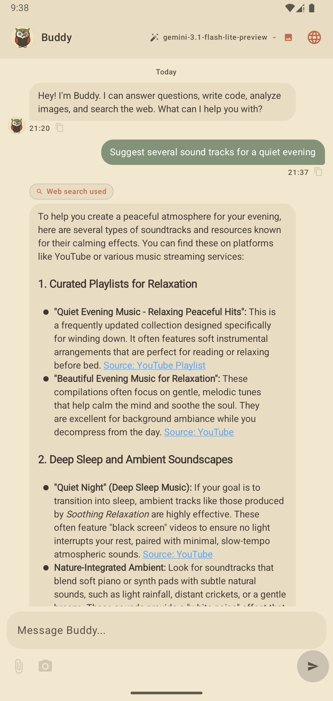
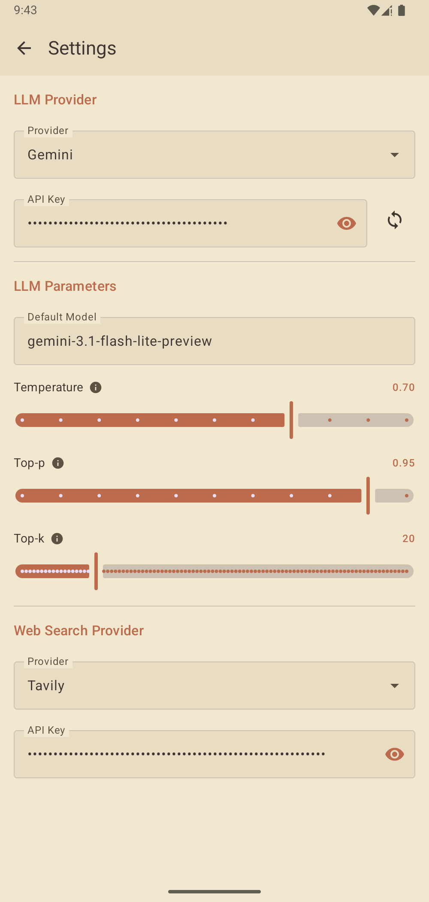
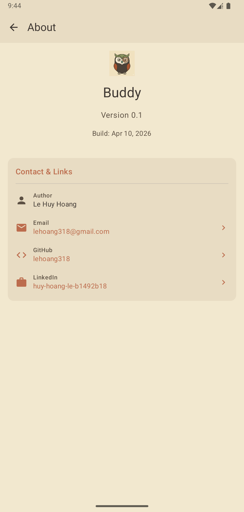

# Buddy

<table>
  <tr>
    <td align="right" valign="top">
      
    </td>
    <td align="left" valign="top">
      <h3>✨ What you can do with <strong>Buddy</strong></h3>
      <ul>
        <li><strong>🌐 Live Web Search</strong>: Real-time web research for verified, up-to-date answers</li>
        <li><strong>🔗 URL Context Import</strong>: Paste any website URL to analyze as conversation background</li>
        <li><strong>📄 Document Intelligence</strong>: Extract insights from images and text files on device</li>
        <li><strong>📸 Camera Analysis</strong>: Instantly process photos via camera capture for text, charts, or data</li>
        <li><strong>⚙️ Provider Selection</strong>: Choose your preferred LLM and Web Search providers</li>
      </ul>
    </td>
  </tr>
</table>

## ✨ Screenshots

  
  
  

## 🚀 Quick Start

1. Generate LLM API Key from [Ollama Cloud](https://docs.ollama.com/cloud#authentication) or any provider in [the supported list](./design/providers.md)

2. Generate Web Search API Key from [Tavily](https://docs.tavily.com/welcome)

3. **Download the APK**
  → [Download Latest Version](https://github.com/lehoang318/buddy/releases/tag/v0.1)

4. **Install** on your Android phone (Android 10.0+ recommended, tested on Xperia 1V - Android 15).

5. **Open the app** and grant camera permissions if you want to use photo capture feature.

6. Settings
* LLM Provider
* Default Model & Parameters
* Web Search Provider

7. **Enjoy!**
