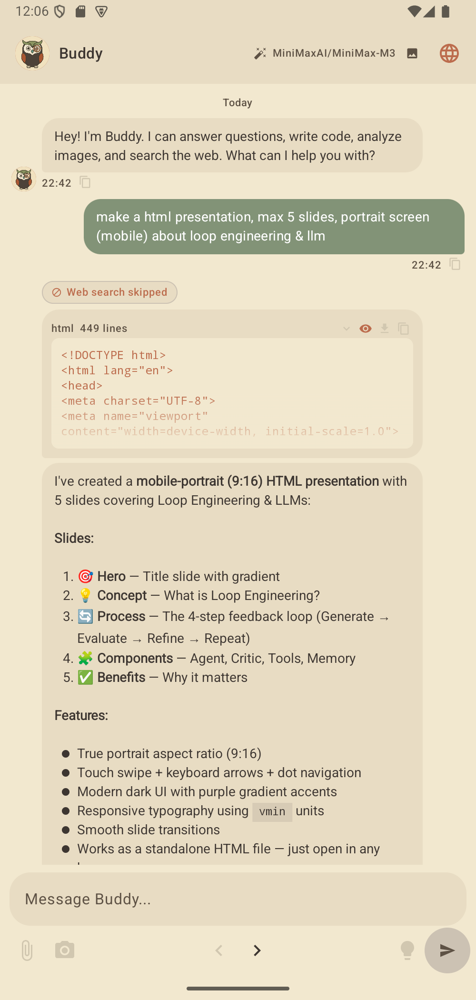
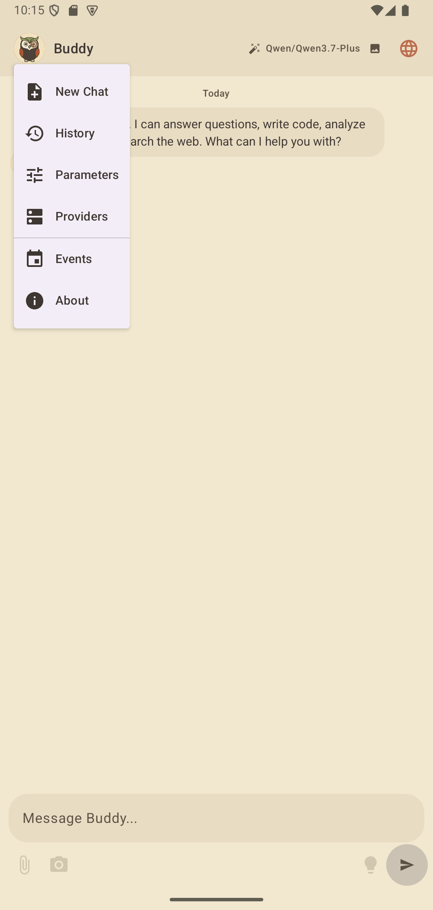
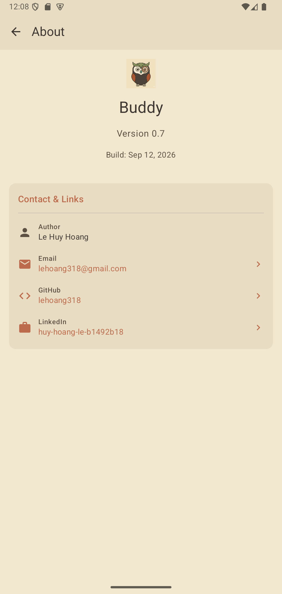
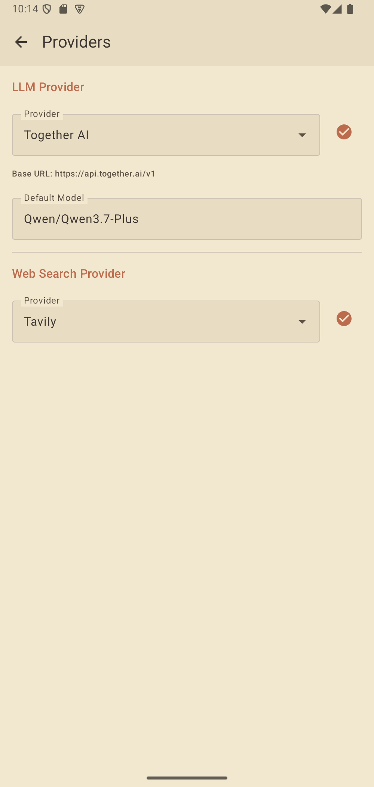
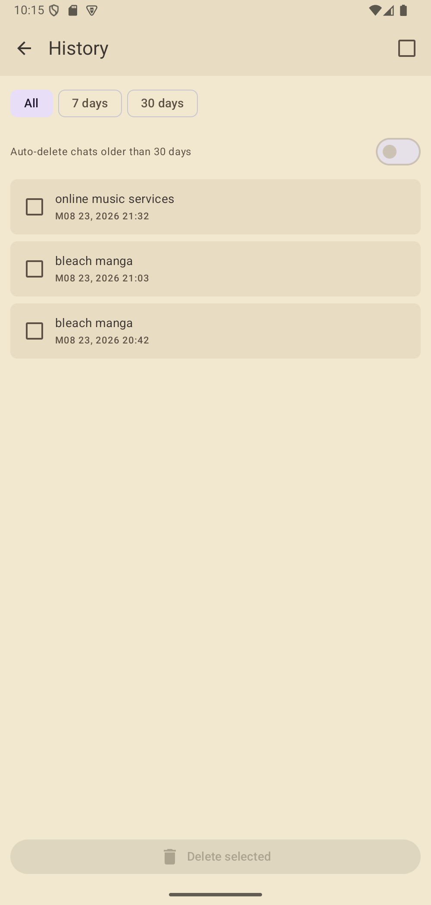
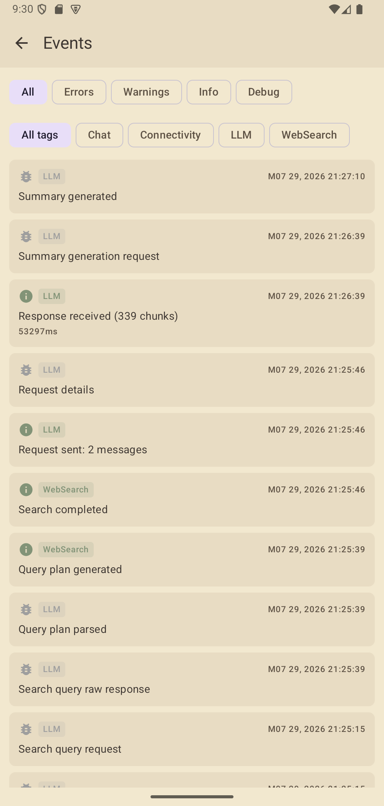

# Buddy

<table>
  <tr>
    <td style="text-align:right; vertical-align:top">
      
    </td>
    <td style="text-align:left; vertical-align:top">
      <h3>✨ What you can do with <strong>Buddy</strong></h3>
      <ul>
        <li><strong>🌐 Live Web Search</strong>: Real-time web research for verified, up-to-date answers</li>
        <li><strong>🔗 URL Context Import</strong>: Paste any website URL to analyze as conversation background</li>
        <li><strong>📄 Document Intelligence</strong>: Extract insights from images and text files on device</li>
        <li><strong>📸 Camera Analysis</strong>: Instantly process photos via camera capture for text, charts, or data</li>
        <li><strong>⚙️ Provider Selection</strong>: Choose your preferred LLM and Web Search providers</li>
        <li><strong>💬 Chat History</strong>: Conversations auto-save and resume, with tag filters and 30-day auto-delete</li>
        <li><strong>🧩 Rich Code Blocks</strong>: Copy, save to Downloads, or preview Markdown and HTML output</li>
      </ul>
    </td>
  </tr>
</table>

## ✨ Screenshots

<div style="display: flex; justify-content: left; gap: 12px; flex-wrap: wrap;">
  
  
  
</div>
<br>
<div style="display: flex; justify-content: left; gap: 12px; flex-wrap: wrap;">
  
  
  
</div>

## 🚀 Quick Start

1. Generate LLM API Key from [Ollama Cloud](https://docs.ollama.com/cloud#authentication), [OpenRouter](https://openrouter.ai/), or any provider in [the supported list](./docs/providers.md). You can also add custom OpenAI-compatible providers.

2. Generate Web Search API Key from [Tavily](https://docs.tavily.com/welcome), [Exa](https://exa.ai/), or [LinkUp](https://www.linkup.so/)

3. **Download the APK**
  → [Download Latest Version](https://github.com/lehoang318/buddy/releases/tag/v0.7)

4. **Install** on your Android phone (Android 10.0+ recommended, tested on Xperia 10 VII - Android 16).

5. **Open the app** and grant camera permissions if you want to use photo capture feature.

6. **Configure Providers**:
   * LLM Provider & API Key
   * Default Model & Parameters
   * Web Search Provider & API Key

> Your keys are safe with Buddy — they're secured by Android Keystore and never stored as plaintext.

7. **Enjoy!**

### Desktop CLI

The desktop CLI is a standalone JVM application. It uses provider API keys from environment variables. Run it with:

```bash
./gradlew :cli:run
```

Or build an executable distribution with:

```bash
./gradlew :cli:installDist
```

The CLI first requires an LLM provider and model selection, then offers optional web-search provider setup before accepting chat messages. It supports `/help`, `/provider`, `/web`, `/attach <file path>`, `/exit`, and `/quit`; Ctrl+D and double Esc also exit.

The CLI reads these environment variables: `FIREWORKS_AI_API_KEY`, `OLLAMA_CLOUD_API_KEY`, `OPEN_ROUTER_API_KEY`, `SILICON_FLOW_API_KEY`, `TOGETHER_AI_API_KEY`, `EXA_API_KEY`, `LINKUP_API_KEY`, and `TAVILY_API_KEY`.

## 🏗️ Architecture

The codebase is split into platform-independent and platform-specific parts:

| Module | Path | Purpose |
|--------|------|---------|
| `:app` (Android) | `src/android/` | Compose UI, DataStore settings, Keystore-backed key cache, session image store, foreground service |
| `:cli` (Desktop) | `src/cli/` | Standalone JVM terminal app; API keys come from environment variables |
| Shared core | `src/common/` | LLM client, web search, URL fetching, conversation engine, session repository, typed config |

The platform-independent `ConversationEngine` owns URL detection/fetching, web search orchestration, message assembly, streaming, and context summarization — both the Android app and the desktop CLI consume its events. Configuration lives in `src/android/main/res/values/*.xml`, read natively on Android and from bundled resources on desktop.

## Documentation

| Document | Description |
|----------|-------------|
| [FAQ](./FAQ.md) | Common questions and answers |
| [Supported Providers](./docs/providers.md) | LLM & Web Search provider details |
| [Use Cases](./docs/use-cases.md) | Step-by-step configuration guides |
| [Context Management](./docs/context-management.md) | History summarization, compression, and Web Data architecture |
| [Session Management](./docs/sessions.md) | Chat history: save/resume, New Chat, and 30-day auto-delete |
| [Web Search Workflow](./docs/web-search.md) | Query-plan generation, lenient parsing for small models, parallel fan-out, recency mapping |
| [Technical Limitations](./docs/limitations.md) | Known constraints and limitations |
| [Dependencies](./docs/dependencies.md) | External library reference |
| [Sequence Diagrams](./docs/seq_chat.md) | Chat flow sequence diagrams |
| [Sequence Diagrams (Others)](./docs/seq_others.md) | Providers, events, and about flow diagrams |

* Refer to [docs](./docs) for internal designs

## License
Distributed under Apache-2.0 license. See [LICENSE](./LICENSE) for more information.

## 🤝 Contributing
Contributions are welcome! Please feel free to submit a Pull Request.
For major changes, please open an issue first to discuss what you would like to change.
