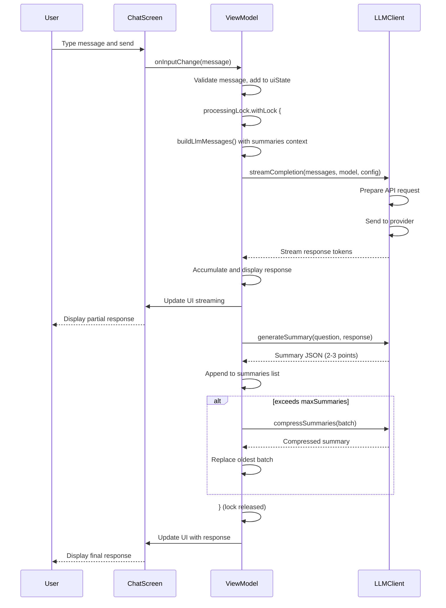
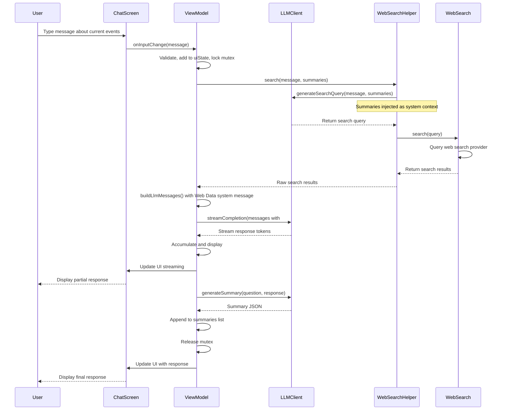
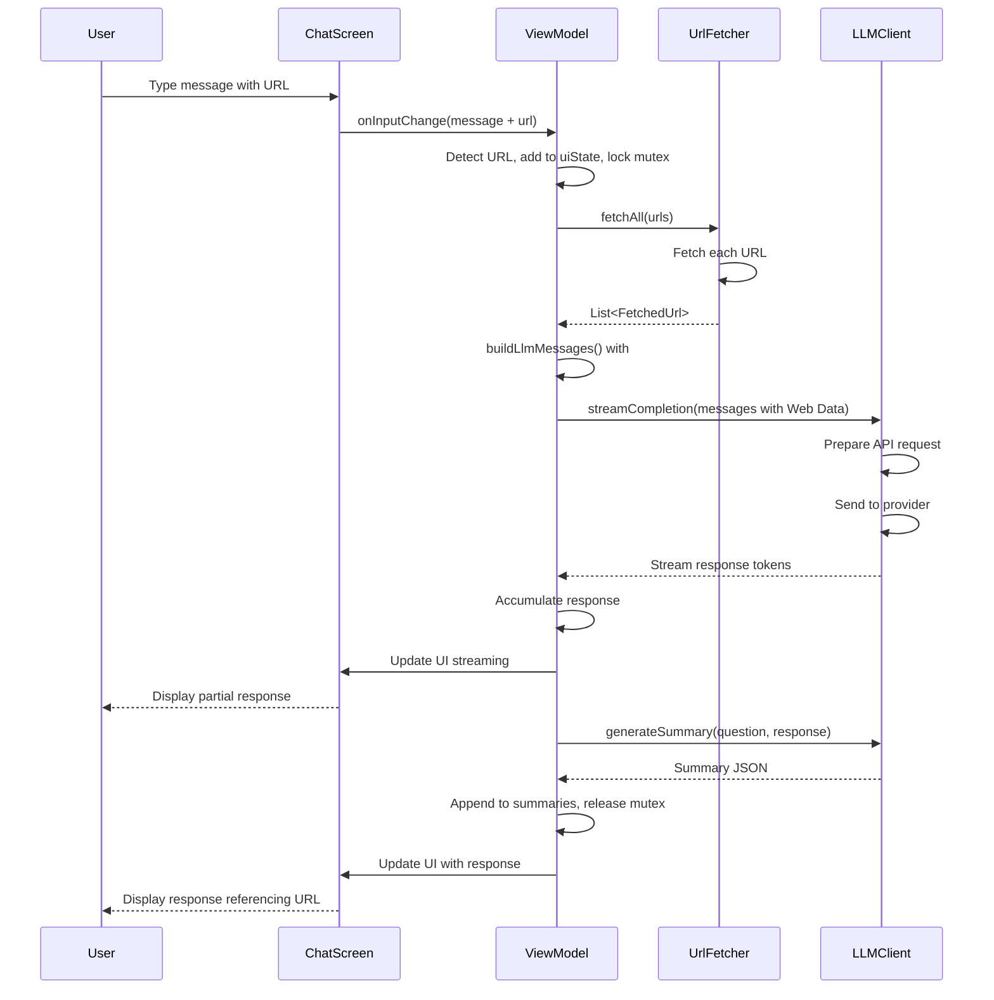
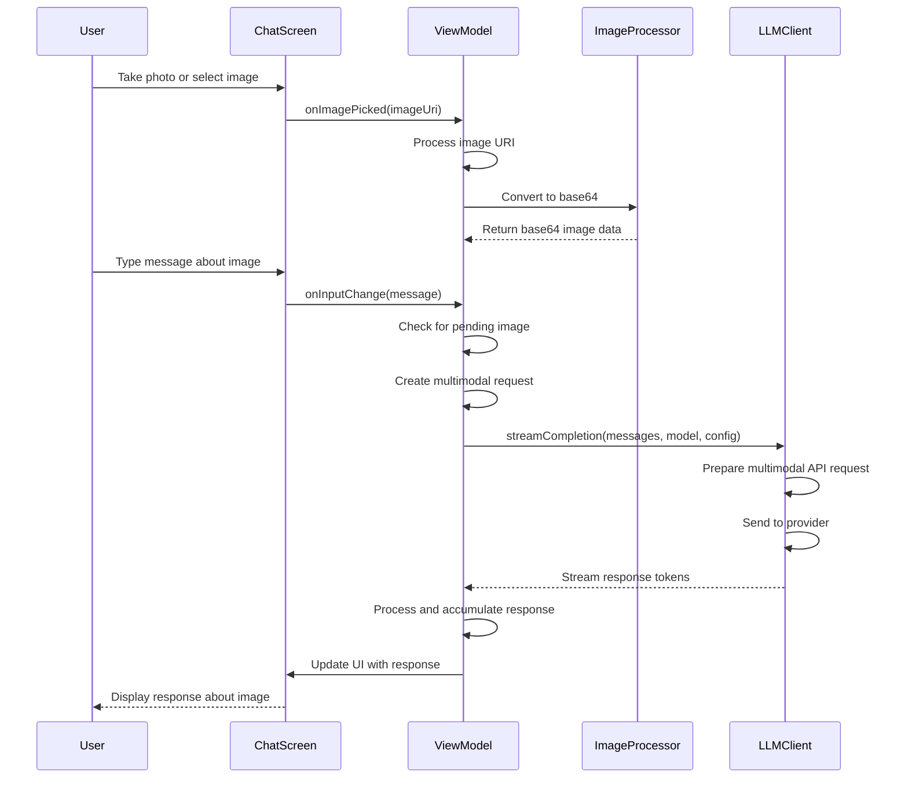
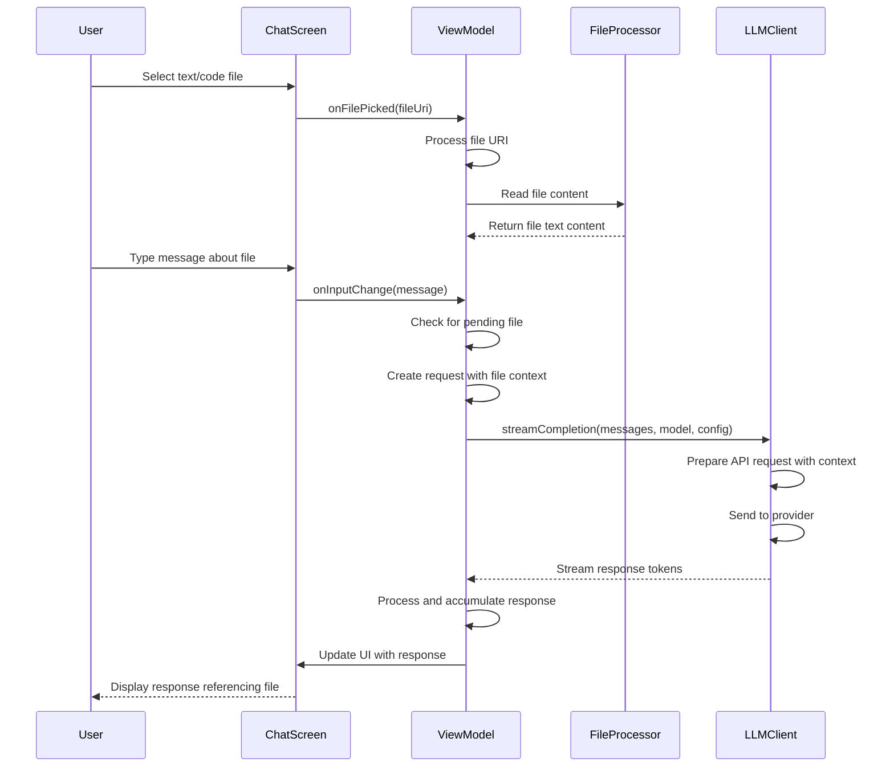
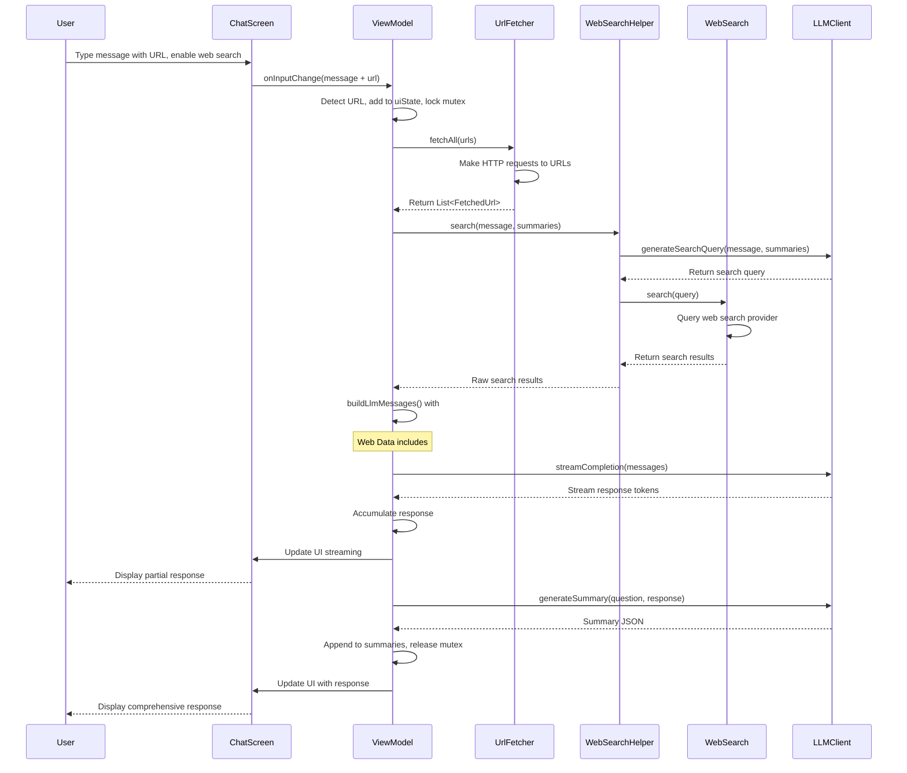
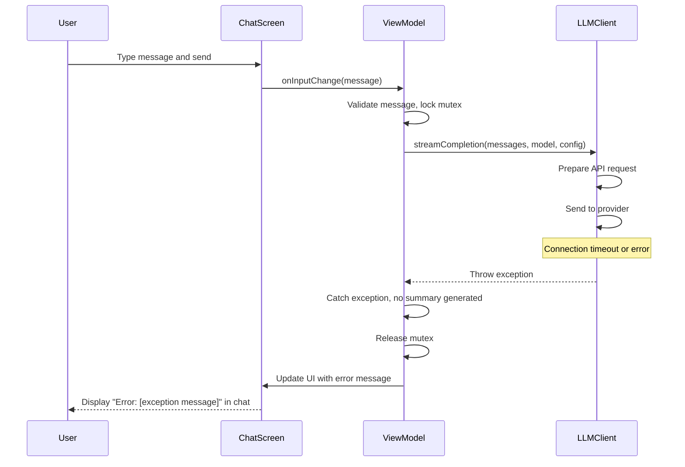
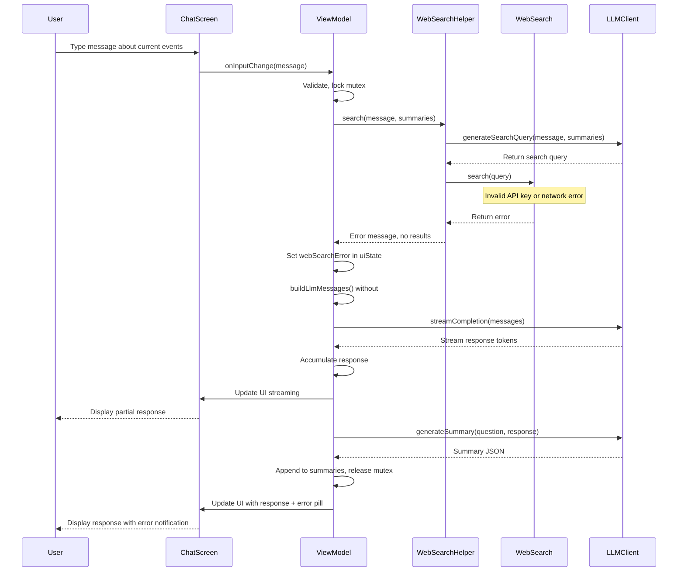
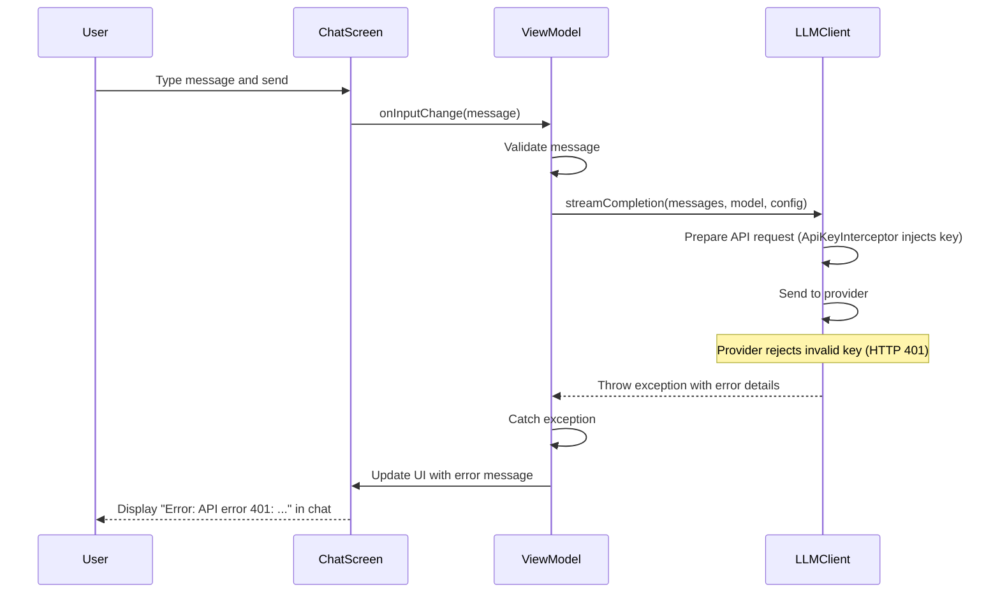
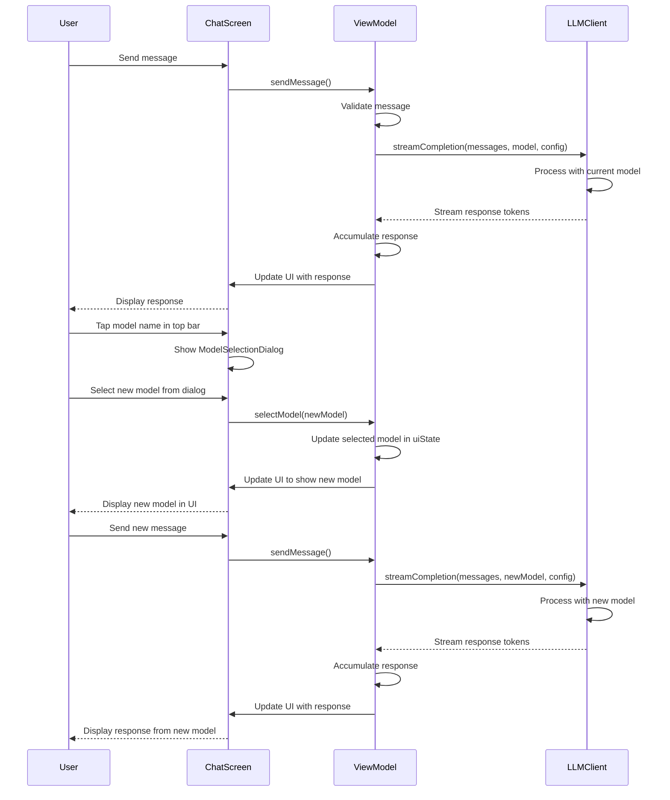

# Buddy AI Assistant - Sequence Diagrams

## Chat Scenarios

### 1. Basic Chat (No Web Search, No URL)

### 2. Chat with Web Search Enabled

### 3. Chat with URL Context

### 4. Chat with Image Attachment

### 5. Chat with File Attachment

### 6. Chat with Web Search + URL Context

### 7. Chat with Connection Error

### 8. Chat with Web Search Error

### 9. Chat with Invalid API Key

### 10. Chat with Model Switch During Session

---

**Note**: These diagrams represent high-level happy path scenarios with alternative branches for common cases. Detailed error handling, retry logic, and edge cases are not shown for clarity.
