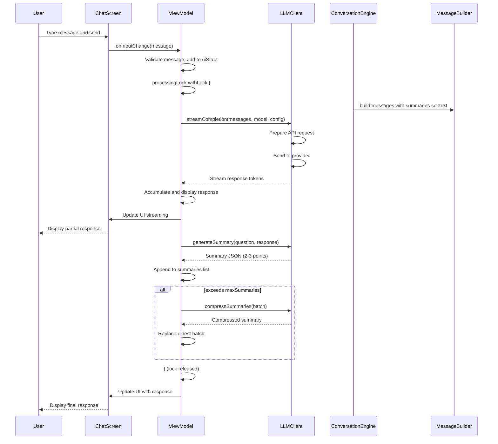
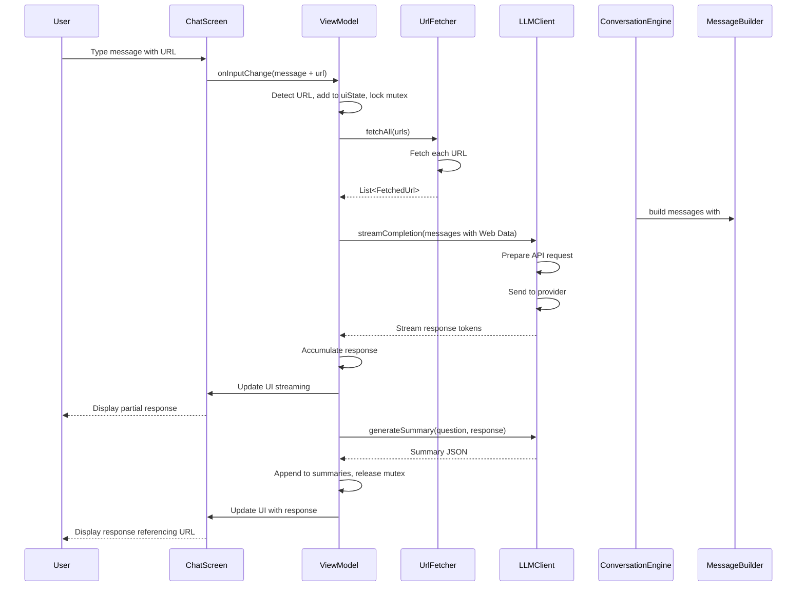
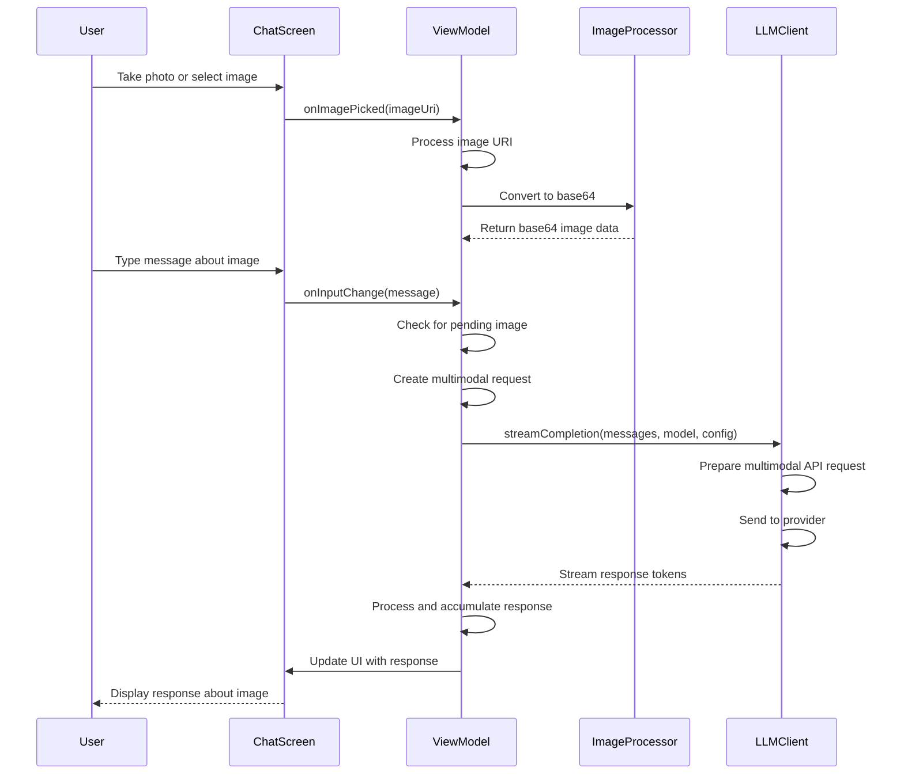
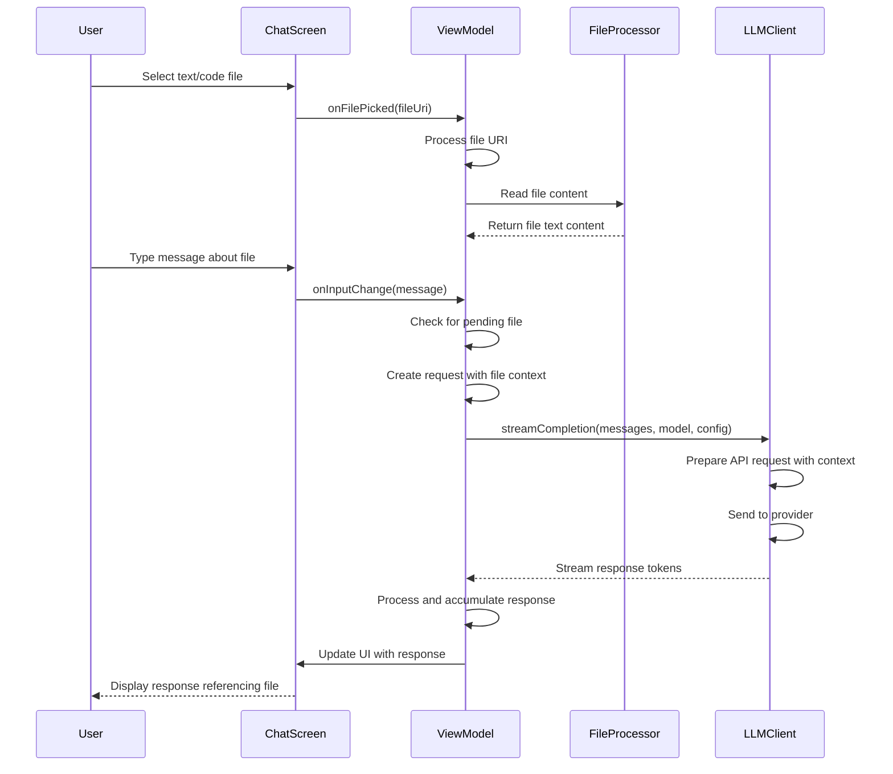
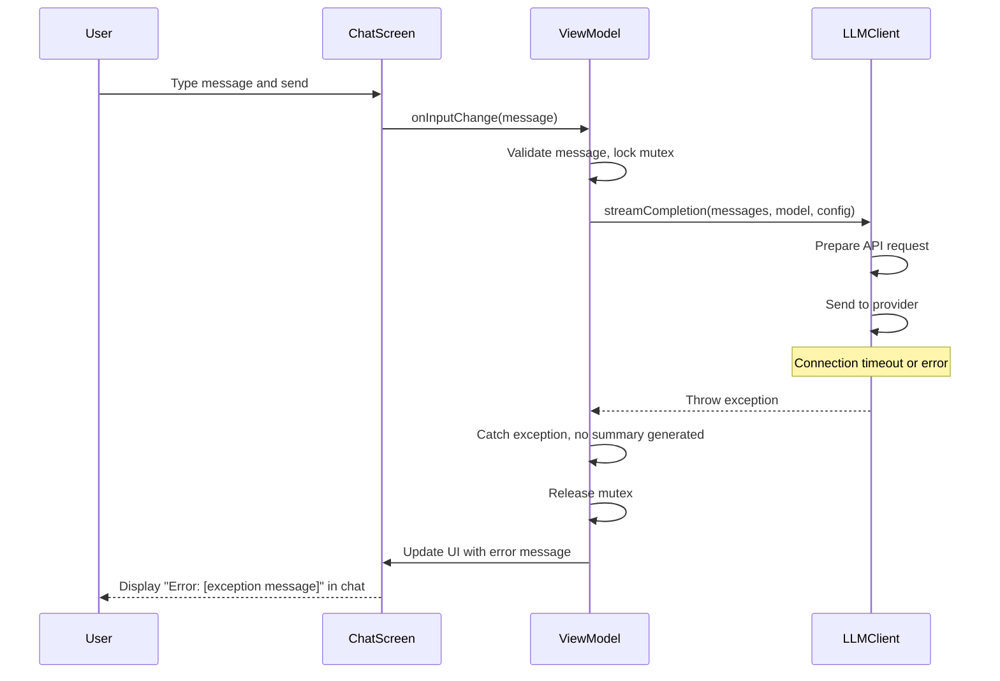
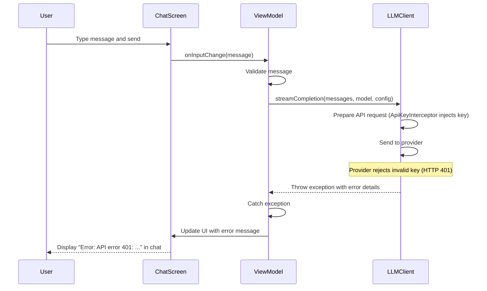
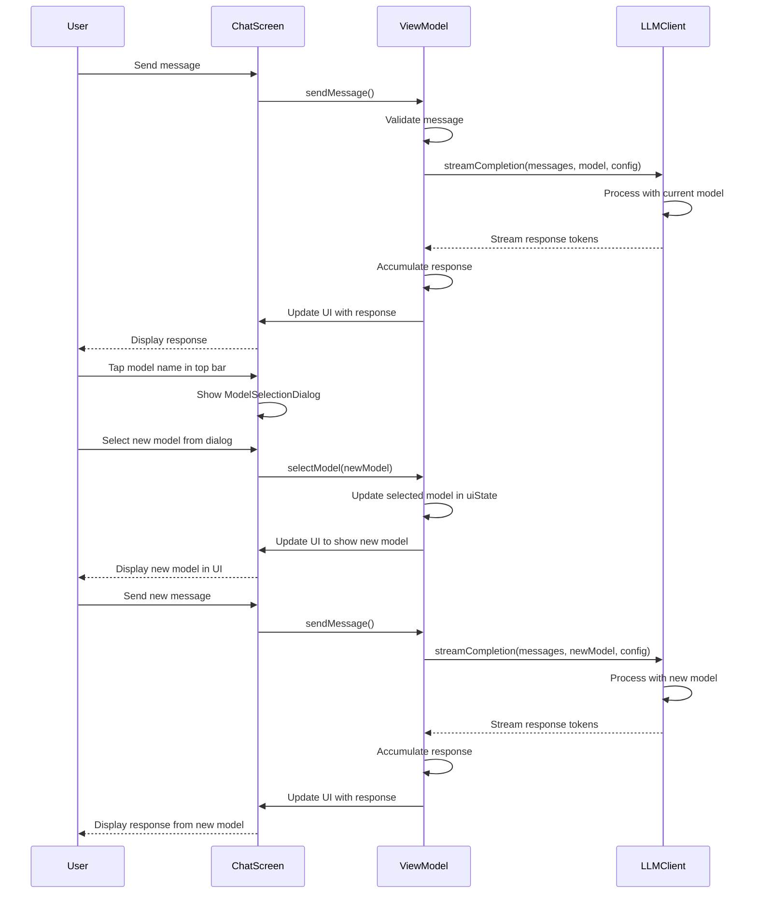

# Buddy AI Assistant - Sequence Diagrams

## Chat Scenarios

### 1. Basic Chat (No Web Search, No URL)

```mermaid
sequenceDiagram
    participant User
    participant ChatScreen
    participant ViewModel
    participant LLMClient

    User->>ChatScreen: Type message and send
    ChatScreen->>ViewModel: onInputChange(message)
    ViewModel->>ViewModel: Validate message, add to uiState
    ViewModel->>ViewModel: processingLock.withLock {
    ConversationEngine->>MessageBuilder: build messages with summaries context
    ViewModel->>LLMClient: streamCompletion(messages, model, config)
    LLMClient->>LLMClient: Prepare API request
    LLMClient->>LLMClient: Send to provider
    LLMClient-->>ViewModel: Stream response tokens
    ViewModel->>ViewModel: Accumulate and display response
    ViewModel->>ChatScreen: Update UI streaming
    ChatScreen-->>User: Display partial response
    ViewModel->>LLMClient: generateSummary(question, response)
    LLMClient-->>ViewModel: Summary JSON (2-3 points)
    ViewModel->>ViewModel: Append to summaries list
    alt exceeds maxSummaries
        ViewModel->>LLMClient: compressSummaries(batch)
        LLMClient-->>ViewModel: Compressed summary
        ViewModel->>ViewModel: Replace oldest batch
    end
    ViewModel->>ViewModel: }  (lock released)
    ViewModel->>ChatScreen: Update UI with response
    ChatScreen-->>User: Display final response
```

### 2. Chat with Web Search Enabled

```mermaid
sequenceDiagram
    participant User
    participant ChatScreen
    participant ViewModel
    participant LLMClient
    participant WebSearchHelper
    participant WebSearch

    User->>ChatScreen: Type message about current events
    ChatScreen->>ViewModel: onInputChange(message)
    ViewModel->>ViewModel: Validate, add to uiState, lock mutex
    ViewModel->>WebSearchHelper: search(message, summaries)
    WebSearchHelper->>LLMClient: generateSearchQuery(message, summaries)
    Note over WebSearchHelper: Summaries injected as system context
    LLMClient-->>WebSearchHelper: Return query plan (1-3 queries + recency) or null
    alt plan is null (NO_QUERY)
        WebSearchHelper-->>ViewModel: WebSearchOutcome(skipped = true)
    else plan parsed
        par one search per query
            WebSearchHelper->>WebSearch: search(query1, recency)
            WebSearchHelper->>WebSearch: search(query2, recency)
        end
        WebSearch-->>WebSearchHelper: SearchResponse per query
        WebSearchHelper->>WebSearchHelper: Interleave, dedupe, cap results; compose answers
        WebSearchHelper-->>ViewModel: Merged results + answer + query label
        ConversationEngine->>MessageBuilder: build messages with Web Data system message
        ViewModel->>LLMClient: streamCompletion(messages with ## Web Data)
        LLMClient-->>ViewModel: Stream response tokens
        ViewModel->>ViewModel: Accumulate and display
        ViewModel->>ChatScreen: Update UI streaming
        ChatScreen-->>User: Display partial response
    end
    ViewModel->>LLMClient: generateSummary(question, response)
    LLMClient-->>ViewModel: Summary JSON
    ViewModel->>ViewModel: Append to summaries list
    ViewModel->>ViewModel: Release mutex
    ViewModel->>ChatScreen: Update UI with response
    ChatScreen-->>User: Display final response (with one "Searched" pill per query)
```

See [web-search.md](./web-search.md) for the full query-plan parsing, fan-out, and merge details.

### 3. Chat with URL Context

```mermaid
sequenceDiagram
    participant User
    participant ChatScreen
    participant ViewModel
    participant UrlFetcher
    participant LLMClient

    User->>ChatScreen: Type message with URL
    ChatScreen->>ViewModel: onInputChange(message + url)
    ViewModel->>ViewModel: Detect URL, add to uiState, lock mutex
    ViewModel->>UrlFetcher: fetchAll(urls)
    UrlFetcher->>UrlFetcher: Fetch each URL
    UrlFetcher-->>ViewModel: List<FetchedUrl>
    ConversationEngine->>MessageBuilder: build messages with ## Web Data > Fetched URL
    ViewModel->>LLMClient: streamCompletion(messages with Web Data)
    LLMClient->>LLMClient: Prepare API request
    LLMClient->>LLMClient: Send to provider
    LLMClient-->>ViewModel: Stream response tokens
    ViewModel->>ViewModel: Accumulate response
    ViewModel->>ChatScreen: Update UI streaming
    ChatScreen-->>User: Display partial response
    ViewModel->>LLMClient: generateSummary(question, response)
    LLMClient-->>ViewModel: Summary JSON
    ViewModel->>ViewModel: Append to summaries, release mutex
    ViewModel->>ChatScreen: Update UI with response
    ChatScreen-->>User: Display response referencing URL
```

### 4. Chat with Image Attachment

```mermaid
sequenceDiagram
    participant User
    participant ChatScreen
    participant ViewModel
    participant ImageProcessor
    participant LLMClient

    User->>ChatScreen: Take photo or select image
    ChatScreen->>ViewModel: onImagePicked(imageUri)
    ViewModel->>ViewModel: Process image URI
    ViewModel->>ImageProcessor: Convert to base64
    ImageProcessor-->>ViewModel: Return base64 image data
    User->>ChatScreen: Type message about image
    ChatScreen->>ViewModel: onInputChange(message)
    ViewModel->>ViewModel: Check for pending image
    ViewModel->>ViewModel: Create multimodal request
    ViewModel->>LLMClient: streamCompletion(messages, model, config)
    LLMClient->>LLMClient: Prepare multimodal API request
    LLMClient->>LLMClient: Send to provider
    LLMClient-->>ViewModel: Stream response tokens
    ViewModel->>ViewModel: Process and accumulate response
    ViewModel->>ChatScreen: Update UI with response
    ChatScreen-->>User: Display response about image
```

### 5. Chat with File Attachment

```mermaid
sequenceDiagram
    participant User
    participant ChatScreen
    participant ViewModel
    participant FileProcessor
    participant LLMClient

    User->>ChatScreen: Select text/code file
    ChatScreen->>ViewModel: onFilePicked(fileUri)
    ViewModel->>ViewModel: Process file URI
    ViewModel->>FileProcessor: Read file content
    FileProcessor-->>ViewModel: Return file text content
    User->>ChatScreen: Type message about file
    ChatScreen->>ViewModel: onInputChange(message)
    ViewModel->>ViewModel: Check for pending file
    ViewModel->>ViewModel: Create request with file context
    ViewModel->>LLMClient: streamCompletion(messages, model, config)
    LLMClient->>LLMClient: Prepare API request with context
    LLMClient->>LLMClient: Send to provider
    LLMClient-->>ViewModel: Stream response tokens
    ViewModel->>ViewModel: Process and accumulate response
    ViewModel->>ChatScreen: Update UI with response
    ChatScreen-->>User: Display response referencing file
```

### 6. Chat with Web Search + URL Context

```mermaid
sequenceDiagram
    participant User
    participant ChatScreen
    participant ViewModel
    participant UrlFetcher
    participant WebSearchHelper
    participant WebSearch
    participant LLMClient

    User->>ChatScreen: Type message with URL, enable web search
    ChatScreen->>ViewModel: onInputChange(message + url)
    ViewModel->>ViewModel: Detect URL, add to uiState, lock mutex
    ViewModel->>UrlFetcher: fetchAll(urls)
    UrlFetcher->>UrlFetcher: Make HTTP requests to URLs
    UrlFetcher-->>ViewModel: Return List<FetchedUrl>
    ViewModel->>WebSearchHelper: search(message, summaries)
    WebSearchHelper->>LLMClient: generateSearchQuery(message, summaries)
    LLMClient-->>WebSearchHelper: Return query plan (1-3 queries + recency)
    WebSearchHelper->>WebSearch: search(query, recency) — one call per query, in parallel
    WebSearch->>WebSearch: Query web search provider
    WebSearch-->>WebSearchHelper: Return search results per query
    WebSearchHelper->>WebSearchHelper: Interleave, dedupe, cap; compose answers
    WebSearchHelper-->>ViewModel: Merged search results
    ConversationEngine->>MessageBuilder: build messages with ## Web Data
    Note over ViewModel: Web Data includes ### Fetched URL + ### Search Engine Summary + ### Web Search
    ViewModel->>LLMClient: streamCompletion(messages)
    LLMClient-->>ViewModel: Stream response tokens
    ViewModel->>ViewModel: Accumulate response
    ViewModel->>ChatScreen: Update UI streaming
    ChatScreen-->>User: Display partial response
    ViewModel->>LLMClient: generateSummary(question, response)
    LLMClient-->>ViewModel: Summary JSON
    ViewModel->>ViewModel: Append to summaries, release mutex
    ViewModel->>ChatScreen: Update UI with response
    ChatScreen-->>User: Display comprehensive response
```

### 7. Chat with Connection Error

```mermaid
sequenceDiagram
    participant User
    participant ChatScreen
    participant ViewModel
    participant LLMClient

    User->>ChatScreen: Type message and send
    ChatScreen->>ViewModel: onInputChange(message)
    ViewModel->>ViewModel: Validate message, lock mutex
    ViewModel->>LLMClient: streamCompletion(messages, model, config)
    LLMClient->>LLMClient: Prepare API request
    LLMClient->>LLMClient: Send to provider
    Note over LLMClient: Connection timeout or error
    LLMClient-->>ViewModel: Throw exception
    ViewModel->>ViewModel: Catch exception, no summary generated
    ViewModel->>ViewModel: Release mutex
    ViewModel->>ChatScreen: Update UI with error message
    ChatScreen-->>User: Display "Error: [exception message]" in chat
```

### 8. Chat with Web Search Error

```mermaid
sequenceDiagram
    participant User
    participant ChatScreen
    participant ViewModel
    participant WebSearchHelper
    participant WebSearch
    participant LLMClient

    User->>ChatScreen: Type message about current events
    ChatScreen->>ViewModel: onInputChange(message)
    ViewModel->>ViewModel: Validate, lock mutex
    ViewModel->>WebSearchHelper: search(message, summaries)
    WebSearchHelper->>LLMClient: generateSearchQuery(message, summaries)
    LLMClient-->>WebSearchHelper: Return query plan (e.g. 2 queries)
    par one search per query
        WebSearchHelper->>WebSearch: search(query1, recency)
        WebSearchHelper->>WebSearch: search(query2, recency)
    end
    alt all queries fail (e.g. invalid API key)
        Note over WebSearch: Invalid API key or network error
        WebSearch-->>WebSearchHelper: Return error for every query
        WebSearchHelper-->>ViewModel: Error message, no results
        ViewModel->>ViewModel: Set webSearchError in uiState
        ConversationEngine->>MessageBuilder: build messages without ## Web Search
    else some queries fail, others succeed
        WebSearch-->>WebSearchHelper: Mixed results/errors
        Note over WebSearchHelper: Warning logged; search proceeds with the successful subset
        WebSearchHelper-->>ViewModel: Partial results (no error pill)
        ConversationEngine->>MessageBuilder: build messages with ## Web Data from partial results
    end
    ViewModel->>LLMClient: streamCompletion(messages)
    LLMClient-->>ViewModel: Stream response tokens
    ViewModel->>ViewModel: Accumulate response
    ViewModel->>ChatScreen: Update UI streaming
    ChatScreen-->>User: Display partial response
    ViewModel->>LLMClient: generateSummary(question, response)
    LLMClient-->>ViewModel: Summary JSON
    ViewModel->>ViewModel: Append to summaries, release mutex
    ViewModel->>ChatScreen: Update UI with response (+ error pill only if all queries failed)
    ChatScreen-->>User: Display response
```

### 9. Chat with Invalid API Key

```mermaid
sequenceDiagram
    participant User
    participant ChatScreen
    participant ViewModel
    participant LLMClient

    User->>ChatScreen: Type message and send
    ChatScreen->>ViewModel: onInputChange(message)
    ViewModel->>ViewModel: Validate message
    ViewModel->>LLMClient: streamCompletion(messages, model, config)
    LLMClient->>LLMClient: Prepare API request (ApiKeyInterceptor injects key)
    LLMClient->>LLMClient: Send to provider
    Note over LLMClient: Provider rejects invalid key (HTTP 401)
    LLMClient-->>ViewModel: Throw exception with error details
    ViewModel->>ViewModel: Catch exception
    ViewModel->>ChatScreen: Update UI with error message
    ChatScreen-->>User: Display "Error: API error 401: ..." in chat
```

### 10. Chat with Model Switch During Session

```mermaid
sequenceDiagram
    participant User
    participant ChatScreen
    participant ViewModel
    participant LLMClient

    User->>ChatScreen: Send message
    ChatScreen->>ViewModel: sendMessage()
    ViewModel->>ViewModel: Validate message
    ViewModel->>LLMClient: streamCompletion(messages, model, config)
    LLMClient->>LLMClient: Process with current model
    LLMClient-->>ViewModel: Stream response tokens
    ViewModel->>ViewModel: Accumulate response
    ViewModel->>ChatScreen: Update UI with response
    ChatScreen-->>User: Display response

    User->>ChatScreen: Tap model name in top bar
    ChatScreen->>ChatScreen: Show ModelSelectionDialog
    User->>ChatScreen: Select new model from dialog
    ChatScreen->>ViewModel: selectModel(newModel)
    ViewModel->>ViewModel: Update selected model in uiState
    ViewModel->>ChatScreen: Update UI to show new model
    ChatScreen-->>User: Display new model in UI

    User->>ChatScreen: Send new message
    ChatScreen->>ViewModel: sendMessage()
    ViewModel->>LLMClient: streamCompletion(messages, newModel, config)
    LLMClient->>LLMClient: Process with new model
    LLMClient-->>ViewModel: Stream response tokens
    ViewModel->>ViewModel: Accumulate response
    ViewModel->>ChatScreen: Update UI with response
    ChatScreen-->>User: Display response from new model
```

---

**Note**: These diagrams represent high-level happy path scenarios with alternative branches for common cases. Detailed error handling, retry logic, and edge cases are not shown for clarity.
