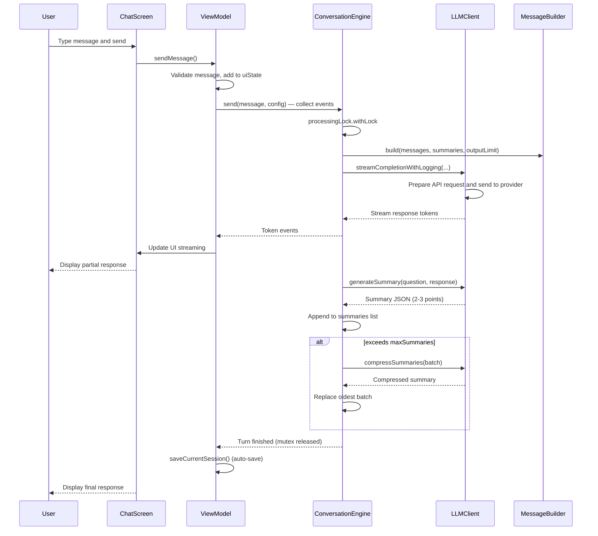
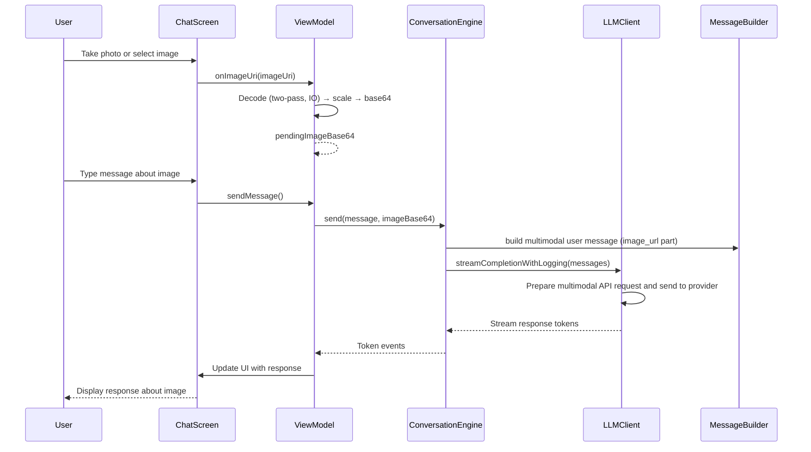
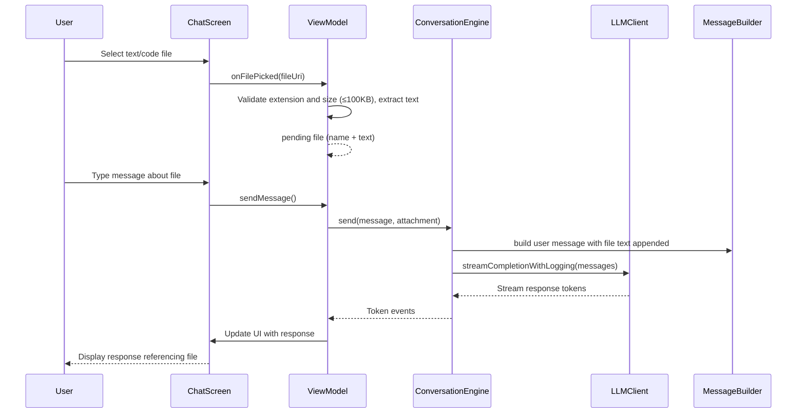
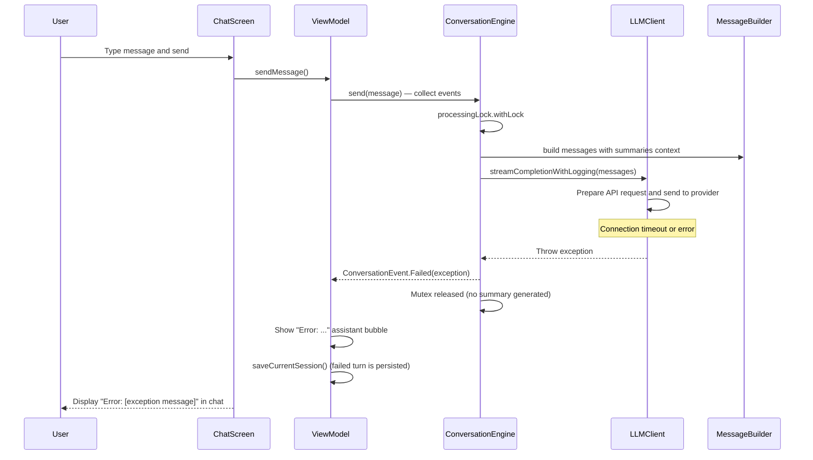
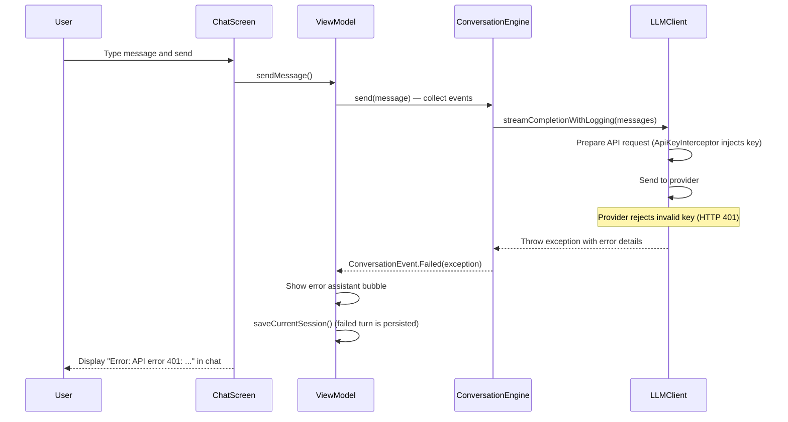
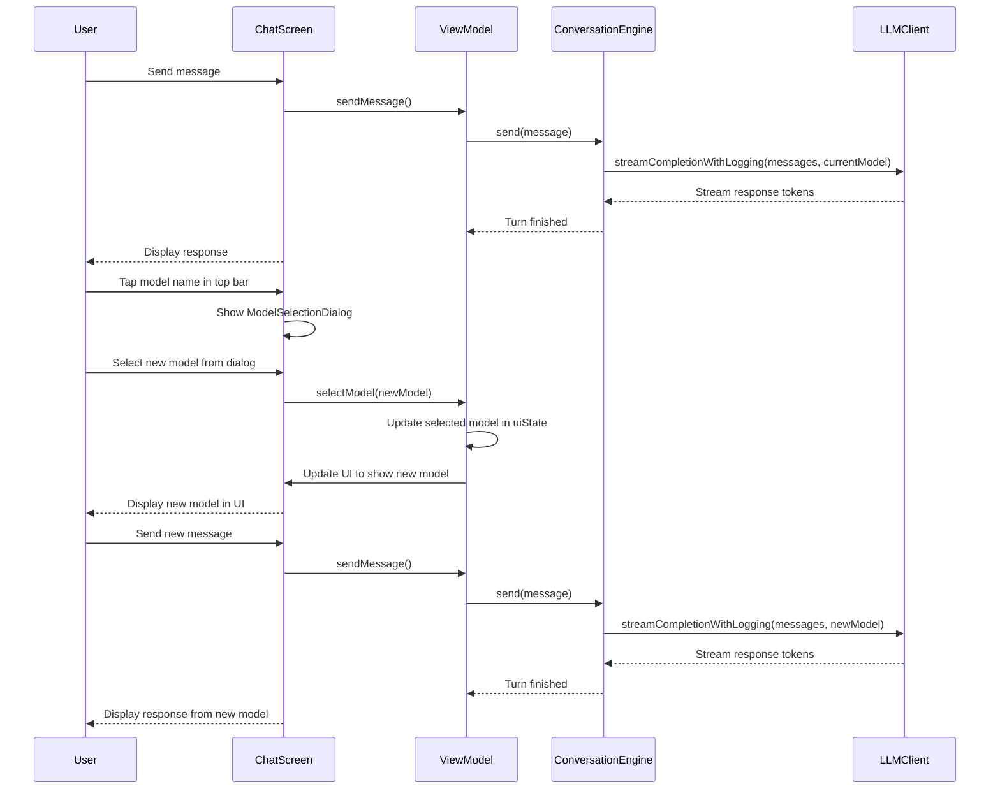

# Buddy AI Assistant - Sequence Diagrams

## Chat Scenarios

The platform-independent `ConversationEngine` (`src/common`) owns turn processing: URL fetching, web search, message assembly (`MessageBuilder`), streaming, and summarization. `ChatViewModel` collects its `ConversationEvent` flow and renders it; the engine's `processingLock` mutex serializes turns.

### 1. Basic Chat (No Web Search, No URL)

```mermaid
sequenceDiagram
    participant User
    participant ChatScreen
    participant ViewModel
    participant Engine as ConversationEngine
    participant LLMClient

    User->>ChatScreen: Type message and send
    ChatScreen->>ViewModel: sendMessage()
    ViewModel->>ViewModel: Validate message, add to uiState
    ViewModel->>Engine: send(message, config) — collect events
    Engine->>Engine: processingLock.withLock
    Engine->>MessageBuilder: build(messages, summaries, outputLimit)
    Engine->>LLMClient: streamCompletionWithLogging(...)
    LLMClient->>LLMClient: Prepare API request and send to provider
    LLMClient-->>Engine: Stream response tokens
    Engine-->>ViewModel: Token events
    ViewModel->>ChatScreen: Update UI streaming
    ChatScreen-->>User: Display partial response
    Engine->>LLMClient: generateSummary(question, response)
    LLMClient-->>Engine: Summary JSON (2-3 points)
    Engine->>Engine: Append to summaries list
    alt exceeds maxSummaries
        Engine->>LLMClient: compressSummaries(batch)
        LLMClient-->>Engine: Compressed summary
        Engine->>Engine: Replace oldest batch
    end
    Engine-->>ViewModel: Turn finished (mutex released)
    ViewModel->>ViewModel: saveCurrentSession() (auto-save)
    ChatScreen-->>User: Display final response
```

### 2. Chat with Web Search Enabled

```mermaid
sequenceDiagram
    participant User
    participant ChatScreen
    participant ViewModel
    participant Engine as ConversationEngine
    participant Helper as WebSearchHelper
    participant LLMClient
    participant WebSearch

    User->>ChatScreen: Type message about current events
    ChatScreen->>ViewModel: sendMessage()
    ViewModel->>Engine: send(message) — collect events
    Engine->>Engine: processingLock.withLock
    Engine->>Helper: search(message, summaries, imageBase64?)
    Helper->>LLMClient: generateSearchQuery(cleanInput, summaries)
    Note over Helper: Summaries injected as context
    LLMClient-->>Helper: Query plan (1-3 queries + recency) or null
    alt plan is null (search not needed or unusable)
        Helper-->>Engine: WebSearchOutcome(skipped = true)
    else plan parsed
        par one search per query
            Helper->>WebSearch: search(query1, recency)
            Helper->>WebSearch: search(query2, recency)
        end
        WebSearch-->>Helper: SearchResponse per query
        Helper->>Helper: Interleave, dedupe, cap results; compose answers
        Helper-->>Engine: Merged results + answer + query label
    end
    Engine->>MessageBuilder: build messages with ## Web Data system message
    Engine->>LLMClient: streamCompletionWithLogging(messages with ## Web Data)
    LLMClient-->>Engine: Stream response tokens
    Engine-->>ViewModel: Token events
    ViewModel->>ChatScreen: Update UI streaming
    ChatScreen-->>User: Display partial response
    Engine->>LLMClient: generateSummary(question, response)
    LLMClient-->>Engine: Summary JSON
    Engine->>Engine: Append to summaries; mutex released
    Engine-->>ViewModel: Turn finished
    ViewModel->>ViewModel: saveCurrentSession() (auto-save)
    ChatScreen-->>User: Display final response (with one "Searched" pill per query)
```

See [web-search.md](./web-search.md) for the full query-plan parsing, fan-out, and merge details.

### 3. Chat with URL Context

```mermaid
sequenceDiagram
    participant User
    participant ChatScreen
    participant ViewModel
    participant Engine as ConversationEngine
    participant UrlFetcher
    participant LLMClient

    User->>ChatScreen: Type message with URL
    ChatScreen->>ViewModel: sendMessage()
    ViewModel->>Engine: send(message) — collect events
    Engine->>UrlFetcher: fetchAll(urls) — outside the mutex
    UrlFetcher-->>Engine: List<FetchedUrl>
    Engine->>Engine: processingLock.withLock
    Engine->>MessageBuilder: build messages with ## Web Data > Fetched URL
    Engine->>LLMClient: streamCompletionWithLogging(messages with Web Data)
    LLMClient->>LLMClient: Prepare API request and send to provider
    LLMClient-->>Engine: Stream response tokens
    Engine-->>ViewModel: Token events
    ViewModel->>ChatScreen: Update UI streaming
    ChatScreen-->>User: Display partial response
    Engine->>LLMClient: generateSummary(question, response)
    LLMClient-->>Engine: Summary JSON
    Engine->>Engine: Append to summaries; mutex released
    Engine-->>ViewModel: Turn finished
    ViewModel->>ViewModel: saveCurrentSession() (auto-save)
    ChatScreen-->>User: Display response referencing URL
```

### 4. Chat with Image Attachment

```mermaid
sequenceDiagram
    participant User
    participant ChatScreen
    participant ViewModel
    participant Engine as ConversationEngine
    participant LLMClient

    User->>ChatScreen: Take photo or select image
    ChatScreen->>ViewModel: onImageUri(imageUri)
    ViewModel->>ViewModel: Decode (two-pass, IO) → scale → base64
    ViewModel-->>ViewModel: pendingImageBase64
    User->>ChatScreen: Type message about image
    ChatScreen->>ViewModel: sendMessage()
    ViewModel->>Engine: send(message, imageBase64)
    Engine->>MessageBuilder: build multimodal user message (image_url part)
    Engine->>LLMClient: streamCompletionWithLogging(messages)
    LLMClient->>LLMClient: Prepare multimodal API request and send to provider
    LLMClient-->>Engine: Stream response tokens
    Engine-->>ViewModel: Token events
    ViewModel->>ChatScreen: Update UI with response
    ChatScreen-->>User: Display response about image
```

### 5. Chat with File Attachment

```mermaid
sequenceDiagram
    participant User
    participant ChatScreen
    participant ViewModel
    participant Engine as ConversationEngine
    participant LLMClient

    User->>ChatScreen: Select text/code file
    ChatScreen->>ViewModel: onFilePicked(fileUri)
    ViewModel->>ViewModel: Validate extension and size (≤100KB), extract text
    ViewModel-->>ViewModel: pending file (name + text)
    User->>ChatScreen: Type message about file
    ChatScreen->>ViewModel: sendMessage()
    ViewModel->>Engine: send(message, attachment)
    Engine->>MessageBuilder: build user message with file text appended
    Engine->>LLMClient: streamCompletionWithLogging(messages)
    LLMClient-->>Engine: Stream response tokens
    Engine-->>ViewModel: Token events
    ViewModel->>ChatScreen: Update UI with response
    ChatScreen-->>User: Display response referencing file
```

### 6. Chat with Web Search + URL Context

```mermaid
sequenceDiagram
    participant User
    participant ChatScreen
    participant ViewModel
    participant Engine as ConversationEngine
    participant UrlFetcher
    participant Helper as WebSearchHelper
    participant LLMClient
    participant WebSearch

    User->>ChatScreen: Type message with URL, enable web search
    ChatScreen->>ViewModel: sendMessage()
    ViewModel->>Engine: send(message) — collect events
    Engine->>UrlFetcher: fetchAll(urls) — outside the mutex
    UrlFetcher-->>Engine: List<FetchedUrl>
    Engine->>Engine: processingLock.withLock
    Engine->>Helper: search(message, summaries)
    Helper->>LLMClient: generateSearchQuery(message, summaries)
    LLMClient-->>Helper: Query plan (1-3 queries + recency)
    Helper->>WebSearch: search(query, recency) — one call per query, in parallel
    WebSearch-->>Helper: Search results per query
    Helper->>Helper: Interleave, dedupe, cap; compose answers
    Helper-->>Engine: Merged search results
    Engine->>MessageBuilder: build messages with ## Web Data
    Note over Engine: Web Data includes ### Fetched URL + ### Search Engine Summary + ### Web Search
    Engine->>LLMClient: streamCompletionWithLogging(messages)
    LLMClient-->>Engine: Stream response tokens
    Engine-->>ViewModel: Token events
    ViewModel->>ChatScreen: Update UI streaming
    ChatScreen-->>User: Display partial response
    Engine->>LLMClient: generateSummary(question, response)
    LLMClient-->>Engine: Summary JSON
    Engine->>Engine: Append to summaries; mutex released
    Engine-->>ViewModel: Turn finished
    ViewModel->>ViewModel: saveCurrentSession() (auto-save)
    ChatScreen-->>User: Display comprehensive response
```

### 7. Chat with Connection Error

```mermaid
sequenceDiagram
    participant User
    participant ChatScreen
    participant ViewModel
    participant Engine as ConversationEngine
    participant LLMClient

    User->>ChatScreen: Type message and send
    ChatScreen->>ViewModel: sendMessage()
    ViewModel->>Engine: send(message) — collect events
    Engine->>Engine: processingLock.withLock
    Engine->>MessageBuilder: build messages with summaries context
    Engine->>LLMClient: streamCompletionWithLogging(messages)
    LLMClient->>LLMClient: Prepare API request and send to provider
    Note over LLMClient: Connection timeout or error
    LLMClient-->>Engine: Throw exception
    Engine-->>ViewModel: ConversationEvent.Failed(exception)
    Engine->>Engine: Mutex released (no summary generated)
    ViewModel->>ViewModel: Show "Error: ..." assistant bubble
    ViewModel->>ViewModel: saveCurrentSession() (failed turn is persisted)
    ChatScreen-->>User: Display "Error: [exception message]" in chat
```

### 8. Chat with Web Search Error

```mermaid
sequenceDiagram
    participant User
    participant ChatScreen
    participant ViewModel
    participant Engine as ConversationEngine
    participant Helper as WebSearchHelper
    participant LLMClient
    participant WebSearch

    User->>ChatScreen: Type message about current events
    ChatScreen->>ViewModel: sendMessage()
    ViewModel->>Engine: send(message) — collect events
    Engine->>Engine: processingLock.withLock
    Engine->>Helper: search(message, summaries)
    Helper->>LLMClient: generateSearchQuery(message, summaries)
    LLMClient-->>Helper: Query plan (e.g. 2 queries)
    par one search per query
        Helper->>WebSearch: search(query1, recency)
        Helper->>WebSearch: search(query2, recency)
    end
    alt all queries fail (e.g. invalid API key)
        Note over WebSearch: Invalid API key or network error
        WebSearch-->>Helper: Error for every query
        Helper-->>Engine: Error message, no results
        Engine-->>ViewModel: SearchFinished outcome with error
        ViewModel->>ViewModel: Show web-search error pill
        Engine->>MessageBuilder: build messages without ## Web Search
    else some queries fail, others succeed
        WebSearch-->>Helper: Mixed results/errors
        Note over Helper: Warning logged; search proceeds with the successful subset
        Helper-->>Engine: Partial results (no error pill)
        Engine->>MessageBuilder: build messages with ## Web Data from partial results
    end
    Engine->>LLMClient: streamCompletionWithLogging(messages)
    LLMClient-->>Engine: Stream response tokens
    Engine-->>ViewModel: Token events
    ViewModel->>ChatScreen: Update UI streaming
    ChatScreen-->>User: Display partial response
    Engine->>LLMClient: generateSummary(question, response)
    LLMClient-->>Engine: Summary JSON
    Engine->>Engine: Append to summaries; mutex released
    ViewModel->>ViewModel: saveCurrentSession() (auto-save)
    ChatScreen-->>User: Display response (+ error pill only if all queries failed)
```

### 9. Chat with Invalid API Key

```mermaid
sequenceDiagram
    participant User
    participant ChatScreen
    participant ViewModel
    participant Engine as ConversationEngine
    participant LLMClient

    User->>ChatScreen: Type message and send
    ChatScreen->>ViewModel: sendMessage()
    ViewModel->>Engine: send(message) — collect events
    Engine->>LLMClient: streamCompletionWithLogging(messages)
    LLMClient->>LLMClient: Prepare API request (ApiKeyInterceptor injects key)
    LLMClient->>LLMClient: Send to provider
    Note over LLMClient: Provider rejects invalid key (HTTP 401)
    LLMClient-->>Engine: Throw exception with error details
    Engine-->>ViewModel: ConversationEvent.Failed(exception)
    ViewModel->>ViewModel: Show error assistant bubble
    ViewModel->>ViewModel: saveCurrentSession() (failed turn is persisted)
    ChatScreen-->>User: Display "Error: API error 401: ..." in chat
```

### 10. Chat with Model Switch During Session

```mermaid
sequenceDiagram
    participant User
    participant ChatScreen
    participant ViewModel
    participant Engine as ConversationEngine
    participant LLMClient

    User->>ChatScreen: Send message
    ChatScreen->>ViewModel: sendMessage()
    ViewModel->>Engine: send(message)
    Engine->>LLMClient: streamCompletionWithLogging(messages, currentModel)
    LLMClient-->>Engine: Stream response tokens
    Engine-->>ViewModel: Turn finished
    ChatScreen-->>User: Display response

    User->>ChatScreen: Tap model name in top bar
    ChatScreen->>ChatScreen: Show ModelSelectionDialog
    User->>ChatScreen: Select new model from dialog
    ChatScreen->>ViewModel: selectModel(newModel)
    ViewModel->>ViewModel: Update selected model in uiState
    ViewModel->>ChatScreen: Update UI to show new model
    ChatScreen-->>User: Display new model in UI

    User->>ChatScreen: Send new message
    ChatScreen->>ViewModel: sendMessage()
    ViewModel->>Engine: send(message)
    Engine->>LLMClient: streamCompletionWithLogging(messages, newModel)
    LLMClient-->>Engine: Stream response tokens
    Engine-->>ViewModel: Turn finished
    ChatScreen-->>User: Display response from new model
```

### 11. Start New Chat / Resume While Streaming

```mermaid
sequenceDiagram
    participant User
    participant ChatScreen
    participant ViewModel
    participant Engine as ConversationEngine
    participant SessionRepository

    User->>ChatScreen: New Chat / resume a saved session (while a response is streaming)
    ChatScreen->>ViewModel: startNewChat() / resumeSession(session)
    ViewModel->>ViewModel: currentJob?.cancelAndJoin()
    ViewModel->>ViewModel: In-flight stream stops; cleanup (webSearchCancelled, etc.) completes
    ViewModel->>ViewModel: saveCurrentSession()  (save the outgoing chat)
    ViewModel->>SessionRepository: addSession(current)
    alt New Chat
        ViewModel->>Engine: clear()
        ViewModel->>ViewModel: Clear UI messages and pending attachments
    else Resume
        ViewModel->>Engine: restore(history, summaries)
        ViewModel->>ViewModel: Restore UI messages (hydrated images, search flags)
    end
    ViewModel->>ChatScreen: Fresh / restored UI
    ChatScreen-->>User: Clean, non-polluted chat
```

- Cancelling and joining before saving ensures the captured outgoing chat is consistent and the old stream's cleanup cannot leak into the new one.
- See [sessions.md](./sessions.md) for the full save/resume and auto-delete behavior.

---

**Note**: These diagrams represent high-level happy path scenarios with alternative branches for common cases. Detailed error handling, retry logic, and edge cases are not shown for clarity.
