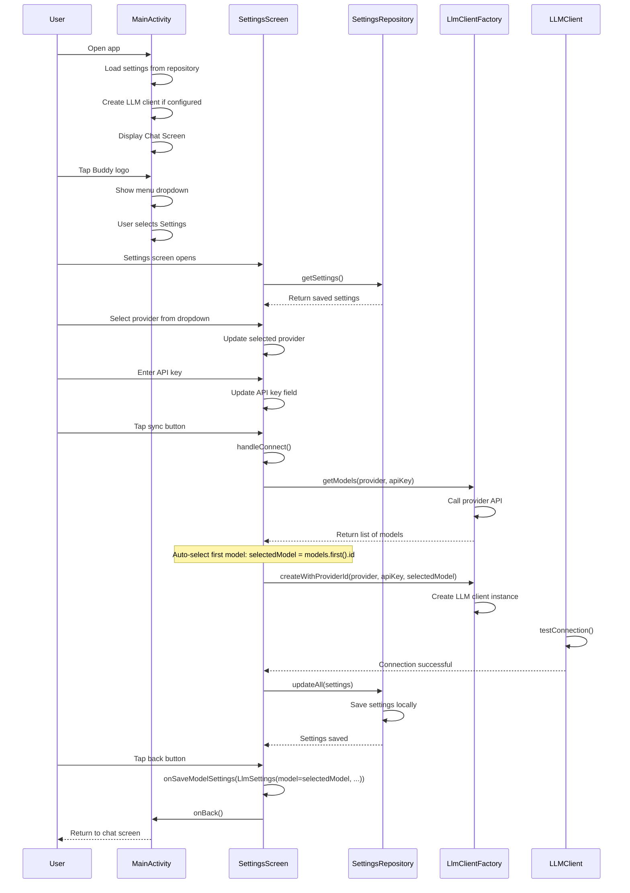
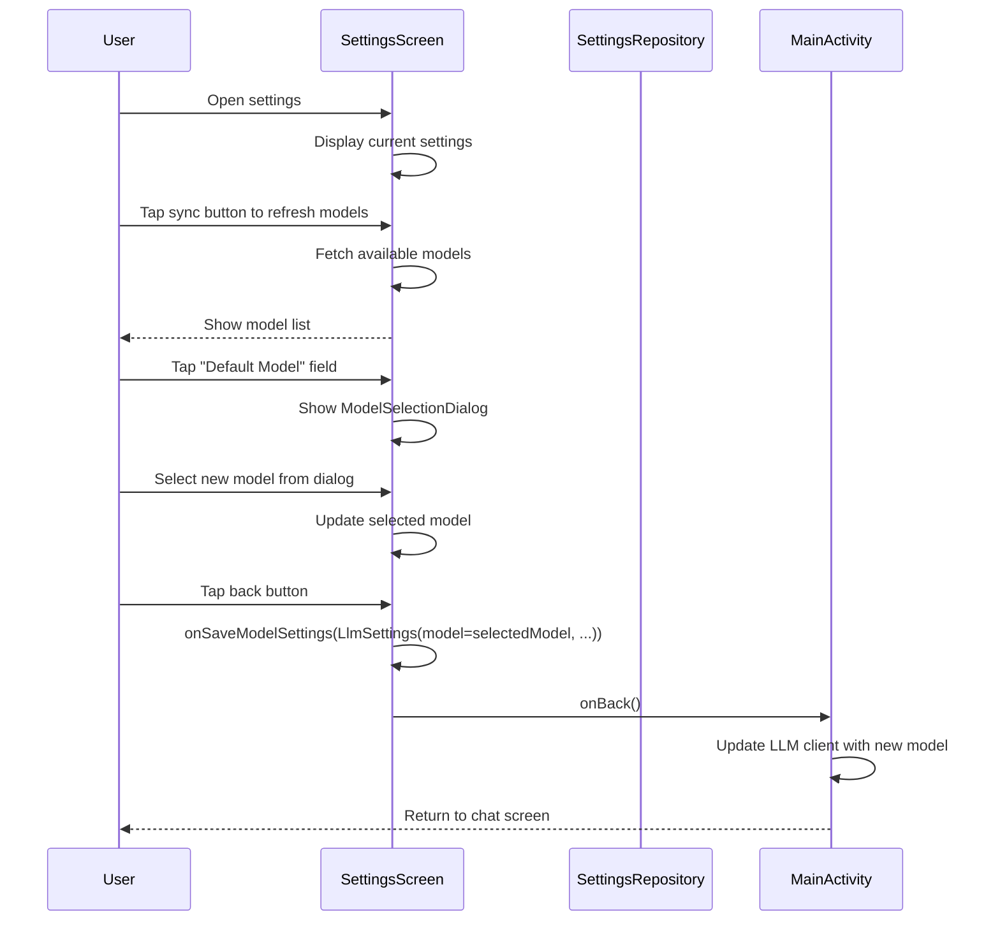
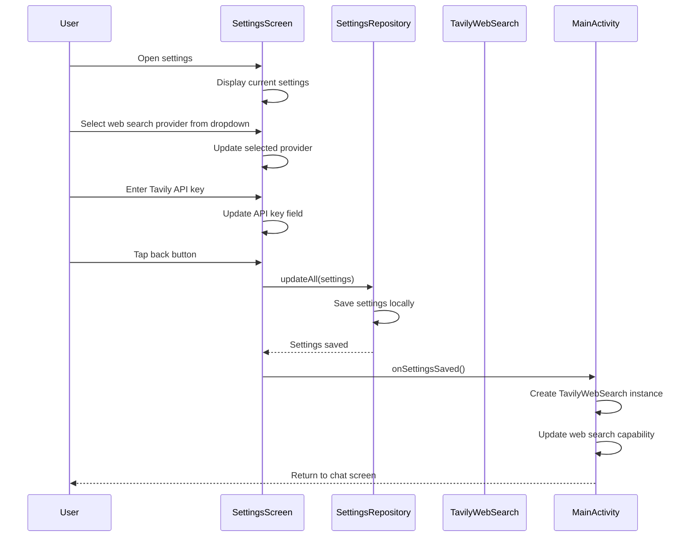
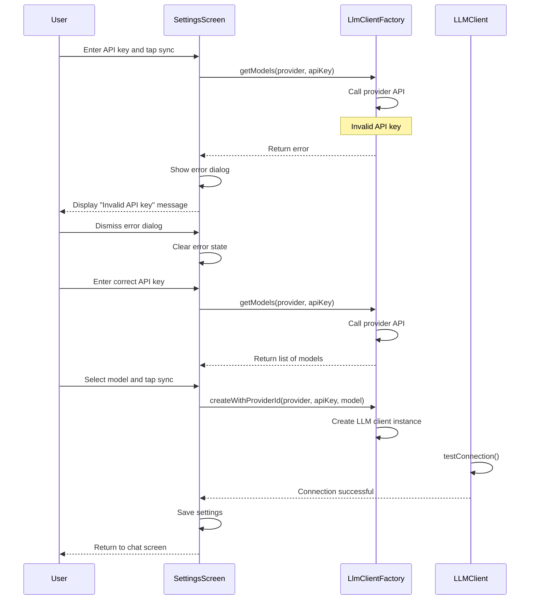
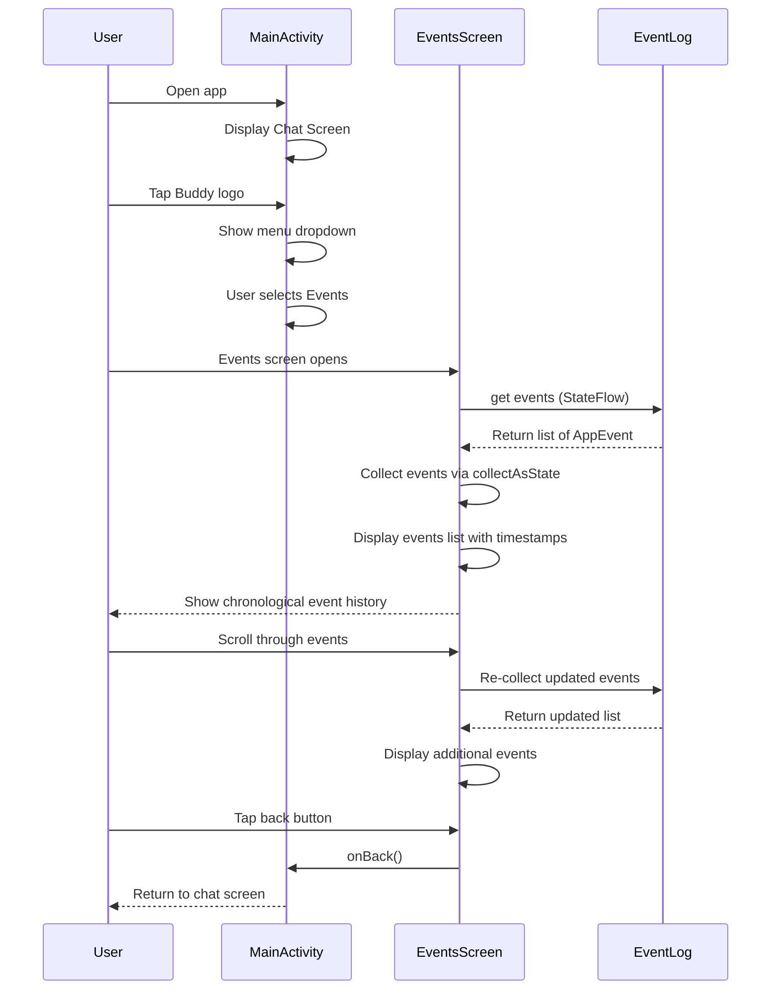
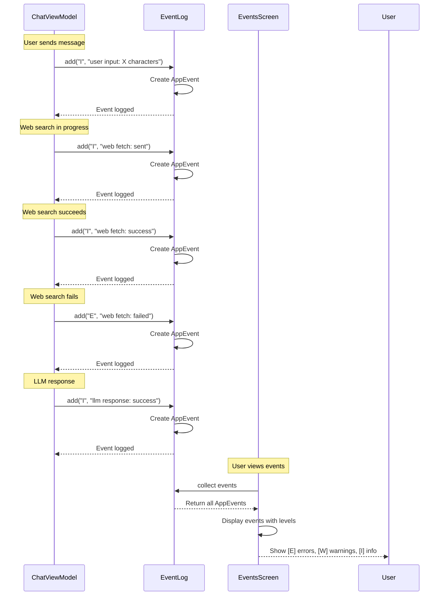
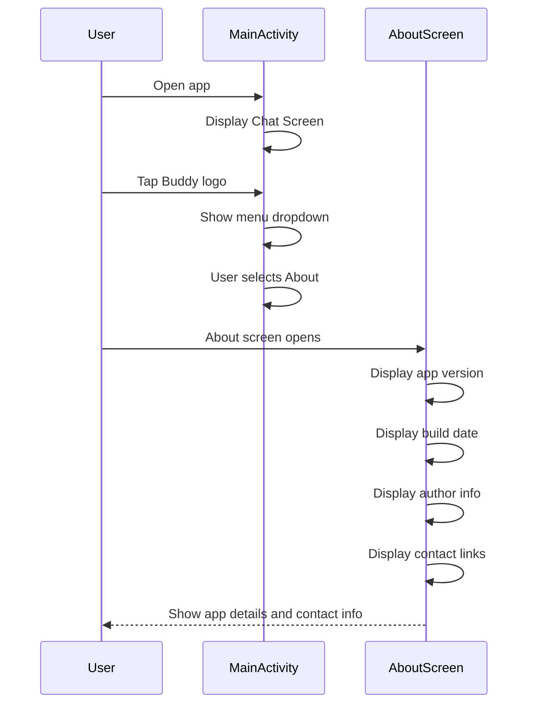
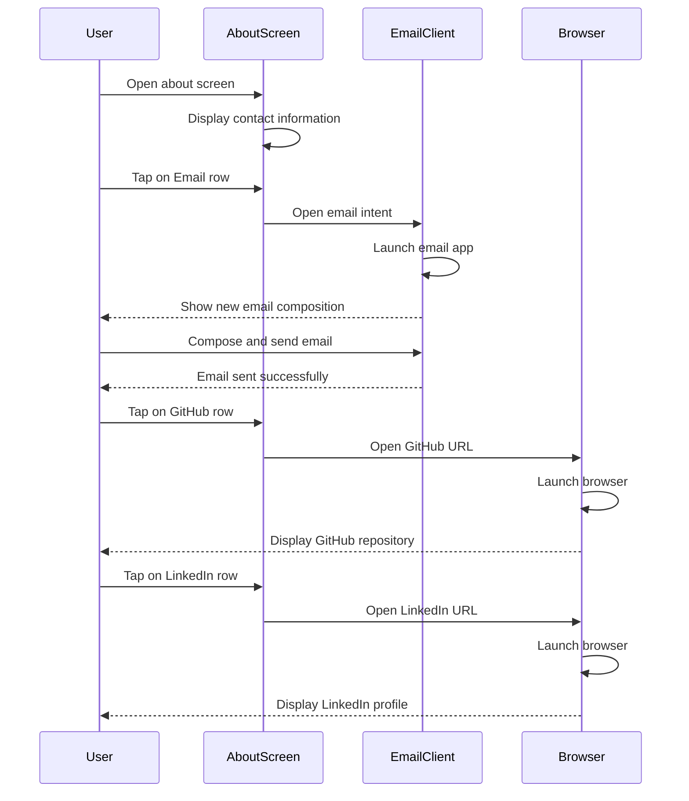
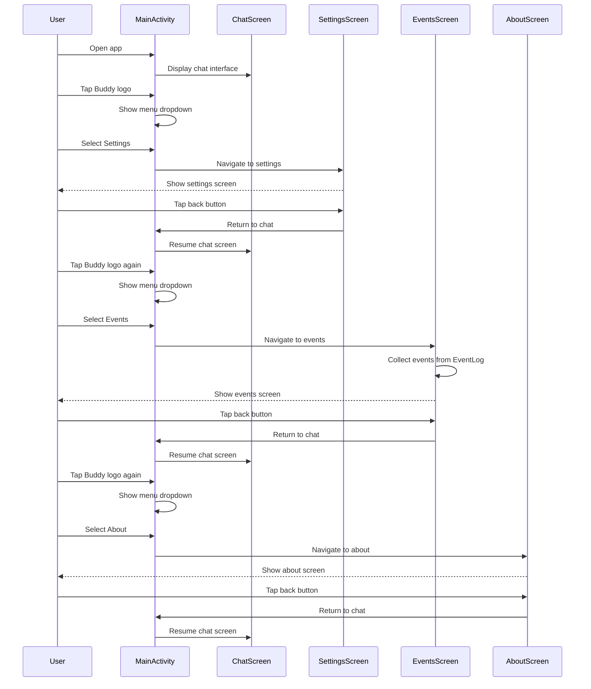
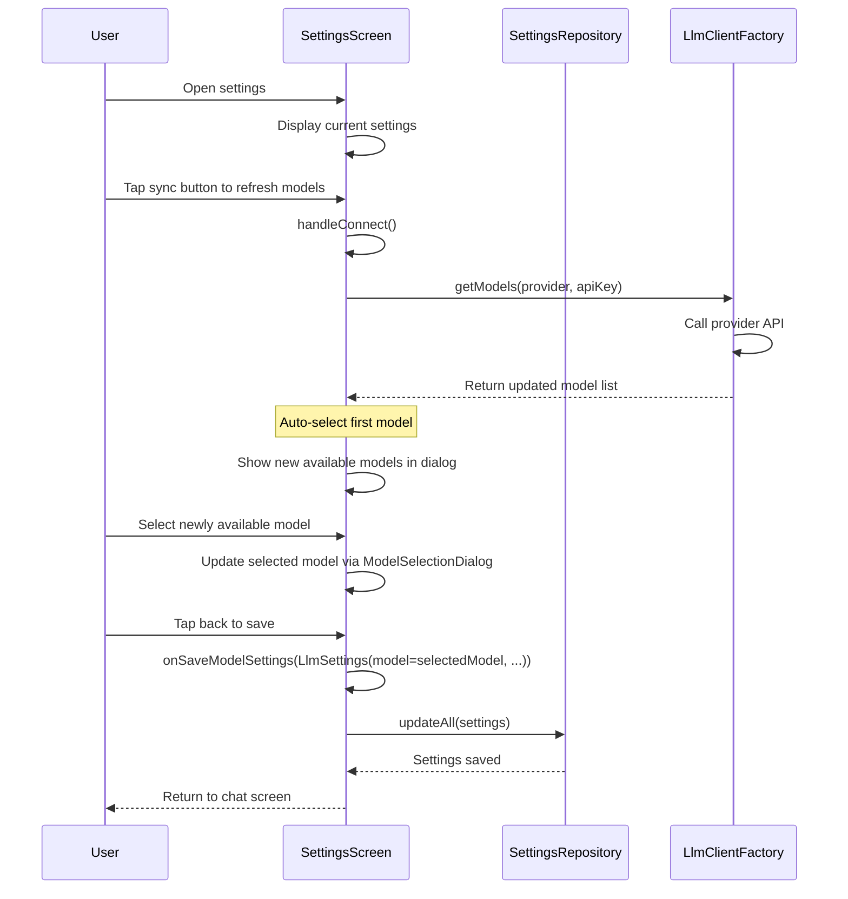

# Buddy AI Assistant - Sequence Diagrams

## Other Scenarios

### 1. Settings - Initial Configuration (Happy Path)

### 2. Settings - Change Model

### 3. Settings - Change Web Search Provider

### 4. Settings - Connection Error Handling

### 5. Events Screen - View Event Log

### 6. Events Screen - Event Types Displayed

### 7. About Screen - Display App Information

### 8. About Screen - Contact Developer

### 9. Settings - Menu Navigation Flow

### 10. Settings - Model Refresh

---

**Note**: These diagrams represent high-level happy path scenarios for settings, events, and about functionality. Detailed error handling and edge cases are not shown for clarity.
