# Buddy AI Assistant - Sequence Diagrams

## Other Scenarios

### 1. Settings - Initial Configuration (Happy Path)

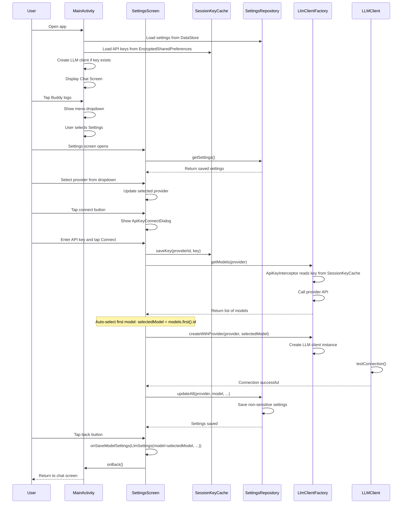

### 2. Settings - Add Custom Provider

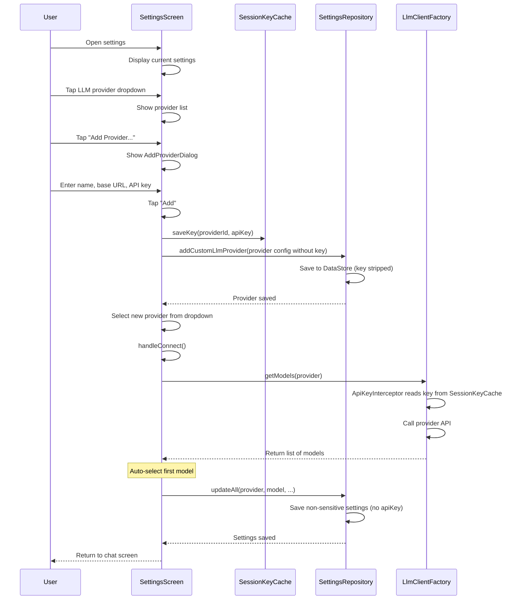

### 3. Settings - Change Model

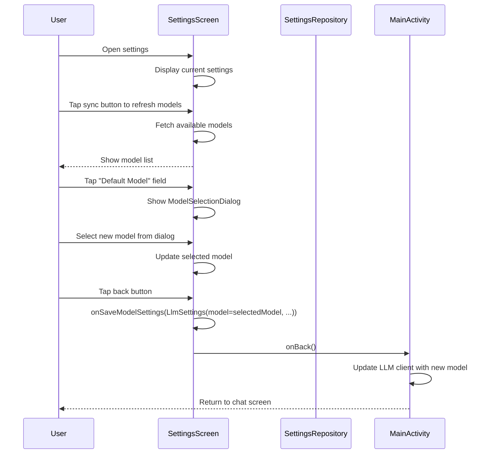

### 4. Settings - Change Web Search Provider

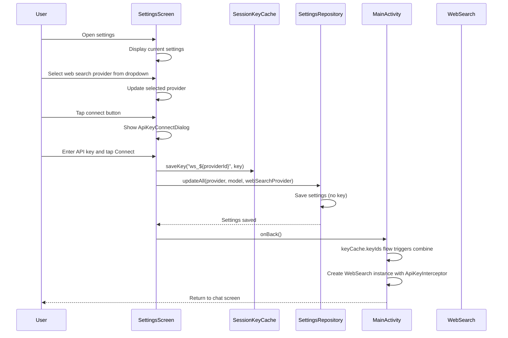

### 5. Settings - Connection Error Handling

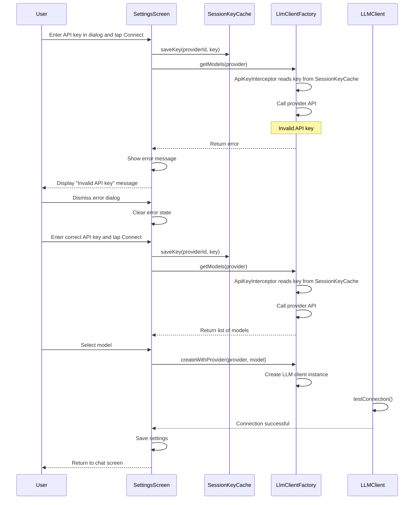

### 6. Events Screen - View Event Log

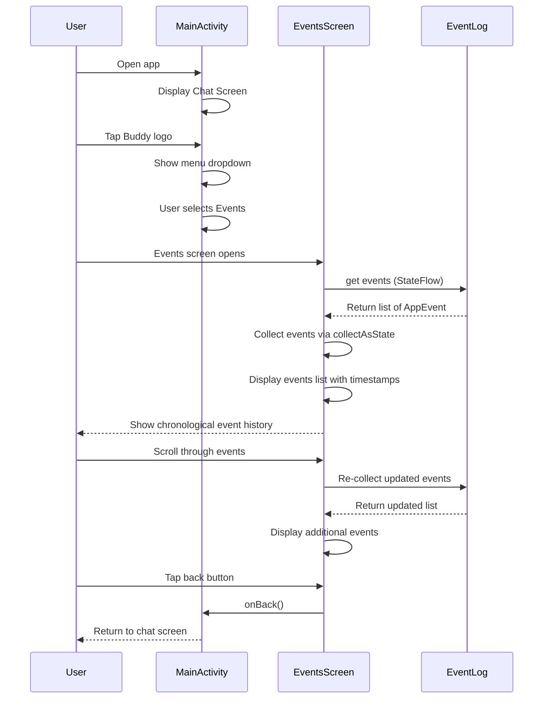

### 7. Events Screen - Event Types Displayed

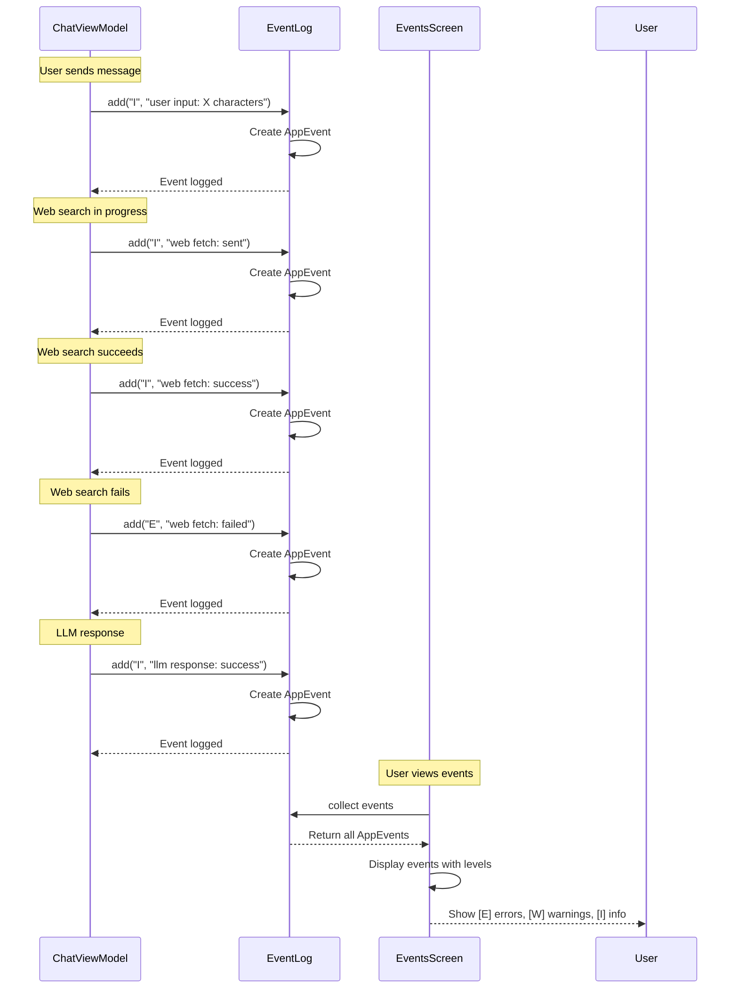

### 8. About Screen - Display App Information

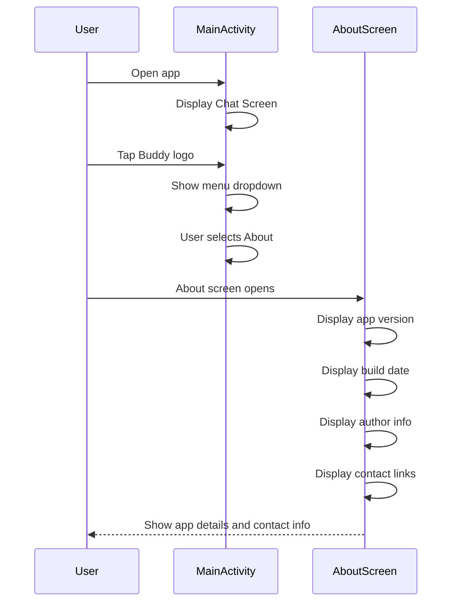

### 9. About Screen - Contact Developer

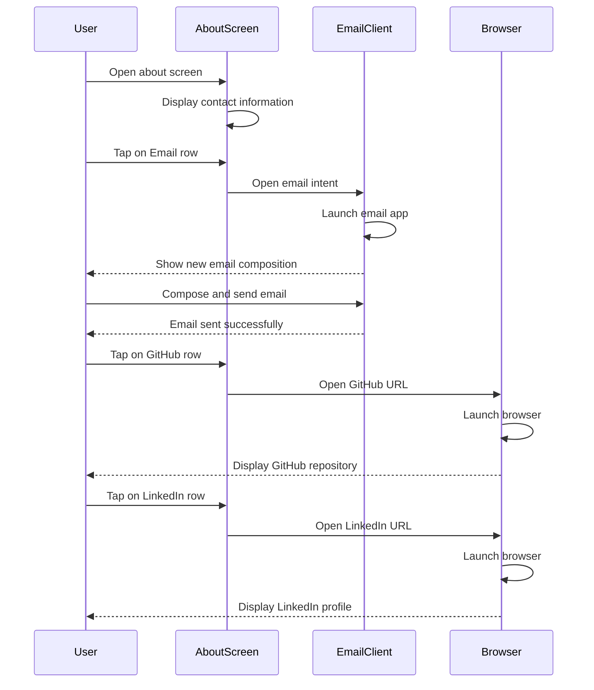

### 10. Settings - Menu Navigation Flow

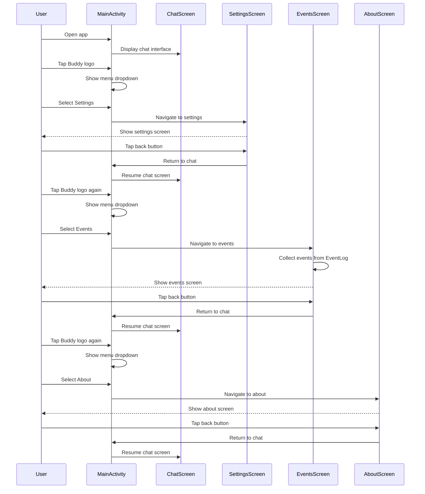

### 11. Settings - Model Refresh

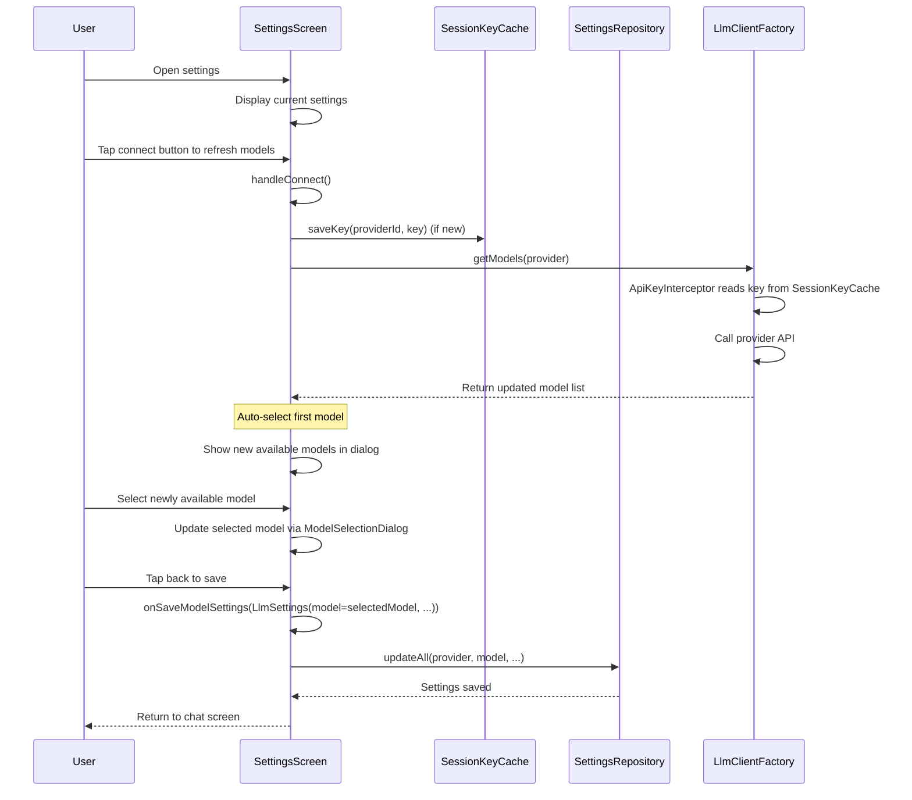

---

**Note**: These diagrams represent high-level happy path scenarios for settings, events, and about functionality. Detailed error handling and edge cases are not shown for clarity.
