# Buddy AI Assistant - Sequence Diagrams

## Other Scenarios

### 1. Providers - Initial Configuration (Happy Path)

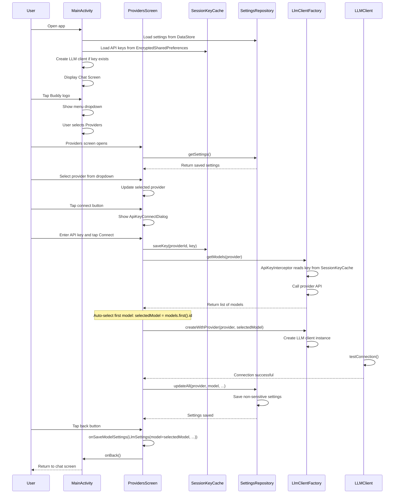
```mermaid
sequenceDiagram
    participant User
    participant MainActivity
    participant ProvidersScreen
    participant SessionKeyCache
    participant SettingsRepository
    participant LlmClientFactory
    participant LLMClient

    User->>MainActivity: Open app
    MainActivity->>SettingsRepository: Load settings from DataStore
    MainActivity->>SessionKeyCache: Load API keys from EncryptedSharedPreferences
    MainActivity->>MainActivity: Create LLM client if key exists
    MainActivity->>MainActivity: Display Chat Screen

    User->>MainActivity: Tap Buddy logo
    MainActivity->>MainActivity: Show menu dropdown
    MainActivity->>MainActivity: User selects Providers

    User->>ProvidersScreen: Providers screen opens
    ProvidersScreen->>SettingsRepository: getSettings()
    SettingsRepository-->>ProvidersScreen: Return saved settings

    User->>ProvidersScreen: Select provider from dropdown
    ProvidersScreen->>ProvidersScreen: Update selected provider

    User->>ProvidersScreen: Tap connect button
    ProvidersScreen->>ProvidersScreen: Show ApiKeyConnectDialog
    User->>ProvidersScreen: Enter API key and tap Connect
    ProvidersScreen->>SessionKeyCache: saveKey(providerId, key)
    ProvidersScreen->>LlmClientFactory: getModels(provider)
    LlmClientFactory->>LlmClientFactory: ApiKeyInterceptor reads key from SessionKeyCache
    LlmClientFactory->>LlmClientFactory: Call provider API
    LlmClientFactory-->>ProvidersScreen: Return list of models

    Note over ProvidersScreen: Auto-select first model: selectedModel = models.first().id

    ProvidersScreen->>LlmClientFactory: createWithProvider(provider, selectedModel)
    LlmClientFactory->>LlmClientFactory: Create LLM client instance
    LLMClient->>LLMClient: testConnection()
    LLMClient-->>ProvidersScreen: Connection successful

    ProvidersScreen->>SettingsRepository: updateAll(provider, model, ...)
    SettingsRepository->>SettingsRepository: Save non-sensitive settings
    SettingsRepository-->>ProvidersScreen: Settings saved

    User->>ProvidersScreen: Tap back button
    ProvidersScreen->>ProvidersScreen: onSaveModelSettings(LlmSettings(model=selectedModel, ...))
    ProvidersScreen->>MainActivity: onBack()
    MainActivity-->>User: Return to chat screen
```

### 2. Providers - Add Custom Provider

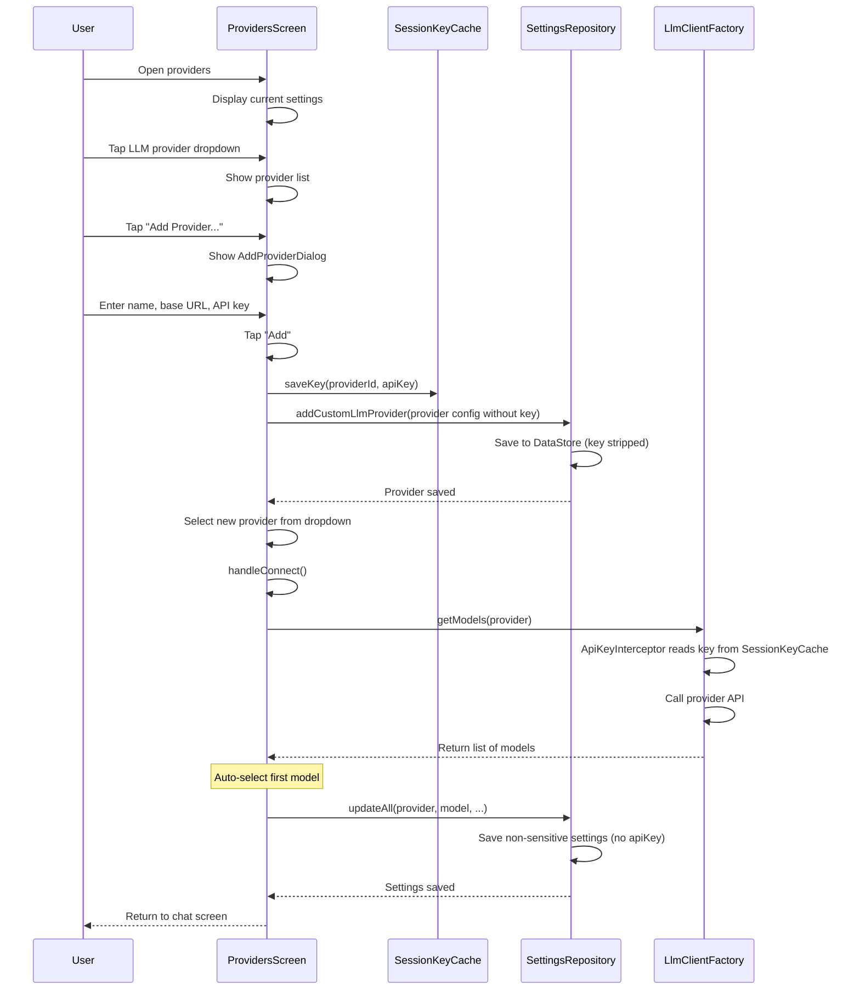
```mermaid
sequenceDiagram
    participant User
    participant ProvidersScreen
    participant SessionKeyCache
    participant SettingsRepository
    participant LlmClientFactory

    User->>ProvidersScreen: Open providers
    ProvidersScreen->>ProvidersScreen: Display current settings

    User->>ProvidersScreen: Tap LLM provider dropdown
    ProvidersScreen->>ProvidersScreen: Show provider list
    User->>ProvidersScreen: Tap "Add Provider..."
    ProvidersScreen->>ProvidersScreen: Show AddProviderDialog

    User->>ProvidersScreen: Enter name, base URL, API key
    ProvidersScreen->>ProvidersScreen: Tap "Add"
    ProvidersScreen->>SessionKeyCache: saveKey(providerId, apiKey)
    ProvidersScreen->>SettingsRepository: addCustomLlmProvider(provider config without key)
    SettingsRepository->>SettingsRepository: Save to DataStore (key stripped)
    SettingsRepository-->>ProvidersScreen: Provider saved

    ProvidersScreen->>ProvidersScreen: Select new provider from dropdown
    ProvidersScreen->>ProvidersScreen: handleConnect()
    ProvidersScreen->>LlmClientFactory: getModels(provider)
    LlmClientFactory->>LlmClientFactory: ApiKeyInterceptor reads key from SessionKeyCache
    LlmClientFactory->>LlmClientFactory: Call provider API
    LlmClientFactory-->>ProvidersScreen: Return list of models

    Note over ProvidersScreen: Auto-select first model

    ProvidersScreen->>SettingsRepository: updateAll(provider, model, ...)
    SettingsRepository->>SettingsRepository: Save non-sensitive settings (no apiKey)
    SettingsRepository-->>ProvidersScreen: Settings saved

    ProvidersScreen-->>User: Return to chat screen
```

### 3. Providers - Change Model

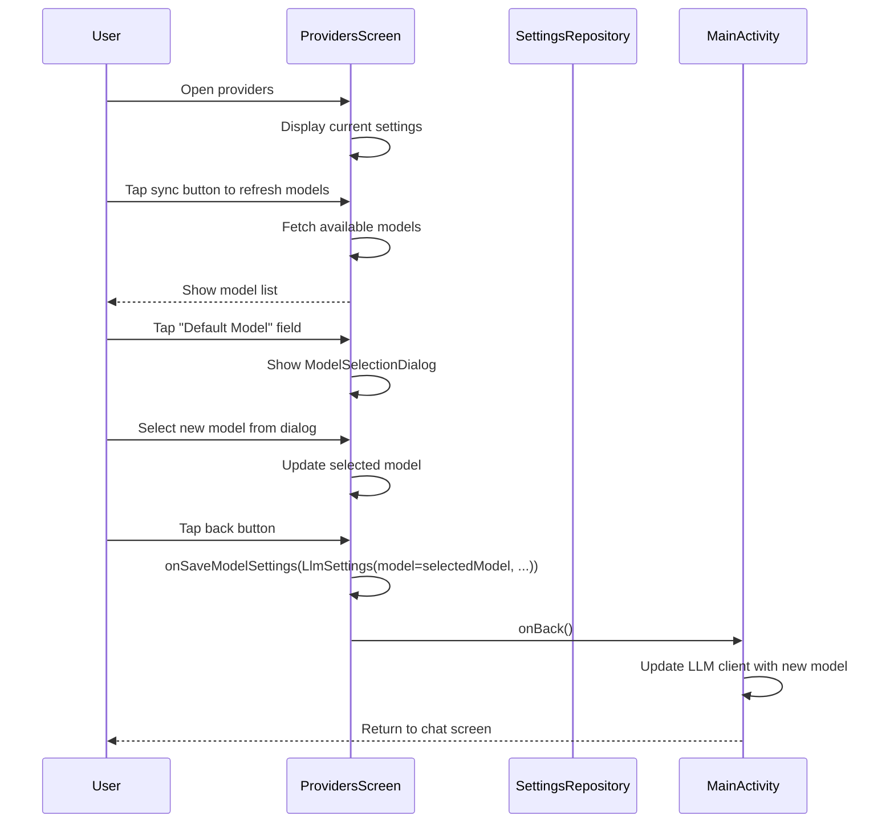
```mermaid
sequenceDiagram
    participant User
    participant ProvidersScreen
    participant SettingsRepository
    participant MainActivity

    User->>ProvidersScreen: Open providers
    ProvidersScreen->>ProvidersScreen: Display current settings

    User->>ProvidersScreen: Tap sync button to refresh models
    ProvidersScreen->>ProvidersScreen: Fetch available models
    ProvidersScreen-->>User: Show model list

    User->>ProvidersScreen: Tap "Default Model" field
    ProvidersScreen->>ProvidersScreen: Show ModelSelectionDialog
    User->>ProvidersScreen: Select new model from dialog
    ProvidersScreen->>ProvidersScreen: Update selected model

    User->>ProvidersScreen: Tap back button
    ProvidersScreen->>ProvidersScreen: onSaveModelSettings(LlmSettings(model=selectedModel, ...))
    ProvidersScreen->>MainActivity: onBack()
    MainActivity->>MainActivity: Update LLM client with new model
    MainActivity-->>User: Return to chat screen
```

### 4. Providers - Change Web Search Provider

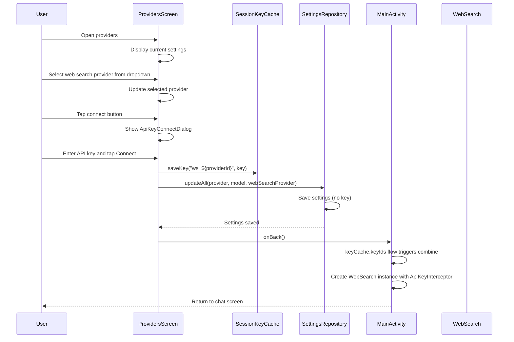
```mermaid
sequenceDiagram
    participant User
    participant ProvidersScreen
    participant SessionKeyCache
    participant SettingsRepository
    participant MainActivity
    participant WebSearch

    User->>ProvidersScreen: Open providers
    ProvidersScreen->>ProvidersScreen: Display current settings

    User->>ProvidersScreen: Select web search provider from dropdown
    ProvidersScreen->>ProvidersScreen: Update selected provider

    User->>ProvidersScreen: Tap connect button
    ProvidersScreen->>ProvidersScreen: Show ApiKeyConnectDialog
    User->>ProvidersScreen: Enter API key and tap Connect
    ProvidersScreen->>SessionKeyCache: saveKey("ws_${providerId}", key)
    ProvidersScreen->>SettingsRepository: updateAll(provider, model, webSearchProvider)
    SettingsRepository->>SettingsRepository: Save settings (no key)
    SettingsRepository-->>ProvidersScreen: Settings saved

    ProvidersScreen->>MainActivity: onBack()
    MainActivity->>MainActivity: keyCache.keyIds flow triggers combine
    MainActivity->>MainActivity: Create WebSearch instance with ApiKeyInterceptor
    MainActivity-->>User: Return to chat screen
```

### 5. Providers - Connection Error Handling

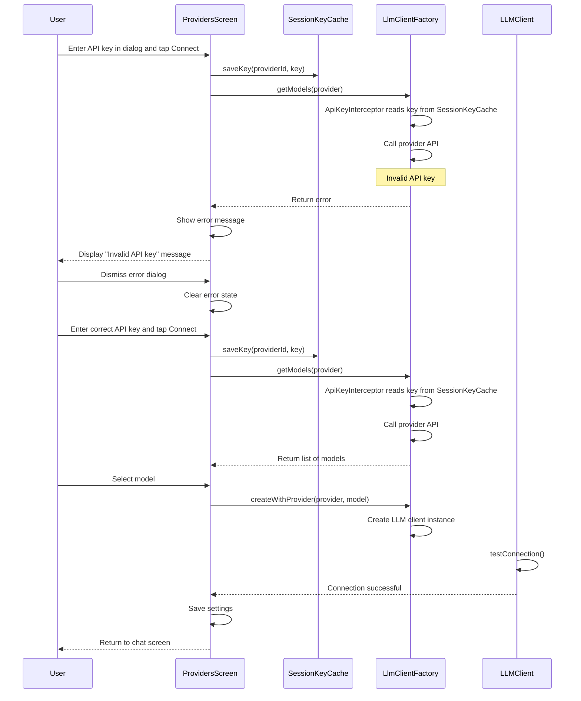
```mermaid
sequenceDiagram
    participant User
    participant ProvidersScreen
    participant SessionKeyCache
    participant LlmClientFactory
    participant LLMClient

    User->>ProvidersScreen: Enter API key in dialog and tap Connect
    ProvidersScreen->>SessionKeyCache: saveKey(providerId, key)
    ProvidersScreen->>LlmClientFactory: getModels(provider)
    LlmClientFactory->>LlmClientFactory: ApiKeyInterceptor reads key from SessionKeyCache
    LlmClientFactory->>LlmClientFactory: Call provider API
    Note over LlmClientFactory: Invalid API key
    LlmClientFactory-->>ProvidersScreen: Return error

    ProvidersScreen->>ProvidersScreen: Show error message
    ProvidersScreen-->>User: Display "Invalid API key" message

    User->>ProvidersScreen: Dismiss error dialog
    ProvidersScreen->>ProvidersScreen: Clear error state

    User->>ProvidersScreen: Enter correct API key and tap Connect
    ProvidersScreen->>SessionKeyCache: saveKey(providerId, key)
    ProvidersScreen->>LlmClientFactory: getModels(provider)
    LlmClientFactory->>LlmClientFactory: ApiKeyInterceptor reads key from SessionKeyCache
    LlmClientFactory->>LlmClientFactory: Call provider API
    LlmClientFactory-->>ProvidersScreen: Return list of models

    User->>ProvidersScreen: Select model
    ProvidersScreen->>LlmClientFactory: createWithProvider(provider, model)
    LlmClientFactory->>LlmClientFactory: Create LLM client instance
    LLMClient->>LLMClient: testConnection()
    LLMClient-->>ProvidersScreen: Connection successful

    ProvidersScreen->>ProvidersScreen: Save settings
    ProvidersScreen-->>User: Return to chat screen
```

### 6. Events Screen - View Event Log

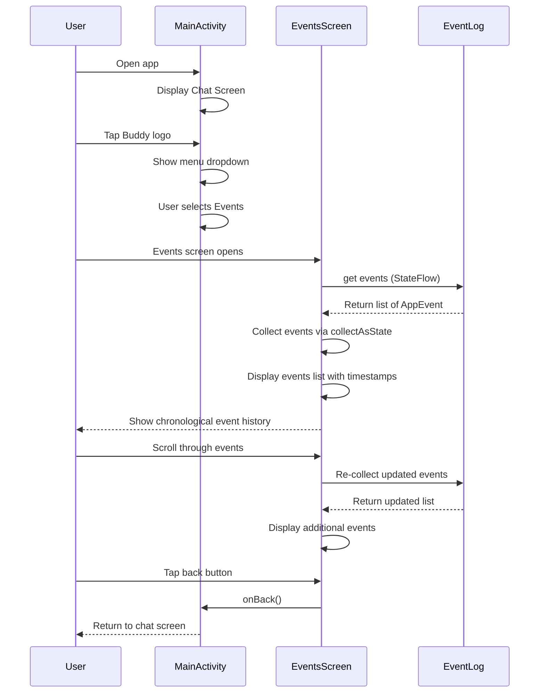
```mermaid
sequenceDiagram
    participant User
    participant MainActivity
    participant EventsScreen
    participant EventLog

    User->>MainActivity: Open app
    MainActivity->>MainActivity: Display Chat Screen

    User->>MainActivity: Tap Buddy logo
    MainActivity->>MainActivity: Show menu dropdown
    MainActivity->>MainActivity: User selects Events

    User->>EventsScreen: Events screen opens
    EventsScreen->>EventLog: get events (StateFlow)
    EventLog-->>EventsScreen: Return list of AppEvent

    EventsScreen->>EventsScreen: Collect events via collectAsState
    EventsScreen->>EventsScreen: Display events list with timestamps
    EventsScreen-->>User: Show chronological event history

    User->>EventsScreen: Scroll through events
    EventsScreen->>EventLog: Re-collect updated events
    EventLog-->>EventsScreen: Return updated list
    EventsScreen->>EventsScreen: Display additional events

    User->>EventsScreen: Tap back button
    EventsScreen->>MainActivity: onBack()
    MainActivity-->>User: Return to chat screen
```

### 7. Events Screen - Event Types Displayed

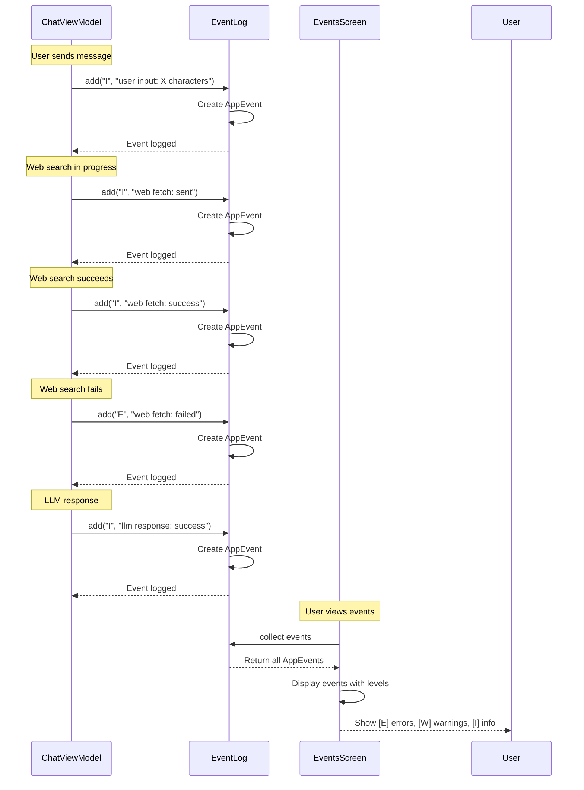
```mermaid
sequenceDiagram
    participant ChatViewModel
    participant EventLog
    participant EventsScreen
    participant User

    Note over ChatViewModel: User sends message
    ChatViewModel->>EventLog: add("I", "user input: X characters")
    EventLog->>EventLog: Create AppEvent
    EventLog-->>ChatViewModel: Event logged

    Note over ChatViewModel: Web search in progress
    ChatViewModel->>EventLog: add("I", "web fetch: sent")
    EventLog->>EventLog: Create AppEvent
    EventLog-->>ChatViewModel: Event logged

    Note over ChatViewModel: Web search succeeds
    ChatViewModel->>EventLog: add("I", "web fetch: success")
    EventLog->>EventLog: Create AppEvent
    EventLog-->>ChatViewModel: Event logged

    Note over ChatViewModel: Web search fails
    ChatViewModel->>EventLog: add("E", "web fetch: failed")
    EventLog->>EventLog: Create AppEvent
    EventLog-->>ChatViewModel: Event logged

    Note over ChatViewModel: LLM response
    ChatViewModel->>EventLog: add("I", "llm response: success")
    EventLog->>EventLog: Create AppEvent
    EventLog-->>ChatViewModel: Event logged

    Note over EventsScreen: User views events
    EventsScreen->>EventLog: collect events
    EventLog-->>EventsScreen: Return all AppEvents
    EventsScreen->>EventsScreen: Display events with levels
    EventsScreen-->>User: Show [E] errors, [W] warnings, [I] info
```

### 8. About Screen - Display App Information

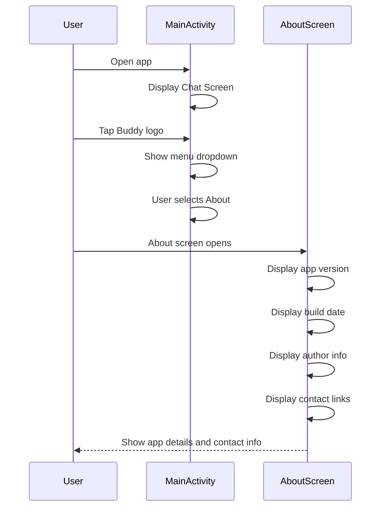
```mermaid
sequenceDiagram
    participant User
    participant MainActivity
    participant AboutScreen

    User->>MainActivity: Open app
    MainActivity->>MainActivity: Display Chat Screen

    User->>MainActivity: Tap Buddy logo
    MainActivity->>MainActivity: Show menu dropdown
    MainActivity->>MainActivity: User selects About

    User->>AboutScreen: About screen opens

    AboutScreen->>AboutScreen: Display app version
    AboutScreen->>AboutScreen: Display build date
    AboutScreen->>AboutScreen: Display author info
    AboutScreen->>AboutScreen: Display contact links

    AboutScreen-->>User: Show app details and contact info
```

### 9. About Screen - Contact Developer

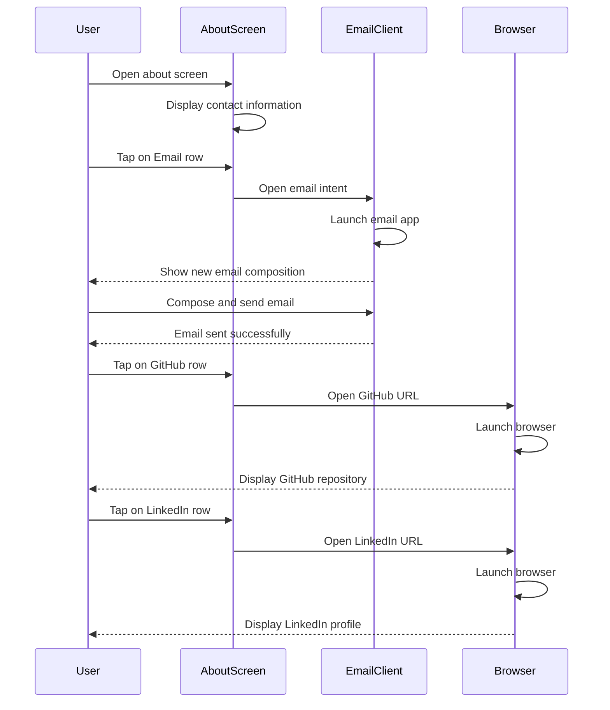
```mermaid
sequenceDiagram
    participant User
    participant AboutScreen
    participant EmailClient
    participant Browser

    User->>AboutScreen: Open about screen
    AboutScreen->>AboutScreen: Display contact information

    User->>AboutScreen: Tap on Email row
    AboutScreen->>EmailClient: Open email intent
    EmailClient->>EmailClient: Launch email app
    EmailClient-->>User: Show new email composition

    User->>EmailClient: Compose and send email
    EmailClient-->>User: Email sent successfully

    User->>AboutScreen: Tap on GitHub row
    AboutScreen->>Browser: Open GitHub URL
    Browser->>Browser: Launch browser
    Browser-->>User: Display GitHub repository

    User->>AboutScreen: Tap on LinkedIn row
    AboutScreen->>Browser: Open LinkedIn URL
    Browser->>Browser: Launch browser
    Browser-->>User: Display LinkedIn profile
```

### 10. Providers - Menu Navigation Flow

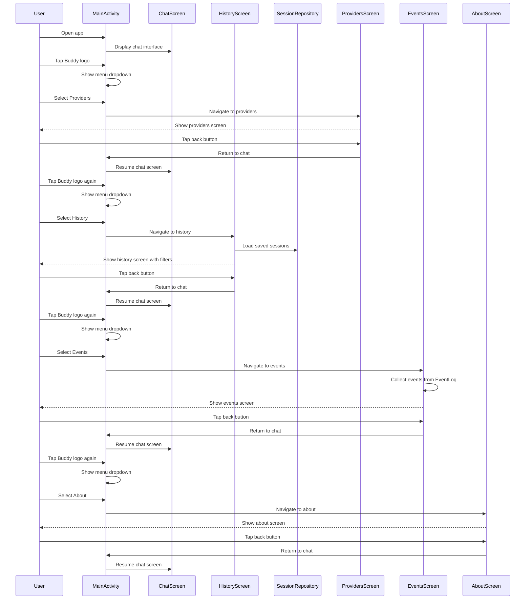
```mermaid
sequenceDiagram
    participant User
    participant MainActivity
    participant ChatScreen
    participant HistoryScreen
    participant SessionRepository
    participant ProvidersScreen
    participant EventsScreen
    participant AboutScreen

    User->>MainActivity: Open app
    MainActivity->>ChatScreen: Display chat interface

    User->>MainActivity: Tap Buddy logo
    MainActivity->>MainActivity: Show menu dropdown

    User->>MainActivity: Select Providers
    MainActivity->>ProvidersScreen: Navigate to providers
    ProvidersScreen-->>User: Show providers screen

    User->>ProvidersScreen: Tap back button
    ProvidersScreen->>MainActivity: Return to chat
    MainActivity->>ChatScreen: Resume chat screen

    User->>MainActivity: Tap Buddy logo again
    MainActivity->>MainActivity: Show menu dropdown

    User->>MainActivity: Select History
    MainActivity->>HistoryScreen: Navigate to history
    HistoryScreen->>SessionRepository: Load saved sessions
    HistoryScreen-->>User: Show history screen with filters

    User->>HistoryScreen: Tap back button
    HistoryScreen->>MainActivity: Return to chat
    MainActivity->>ChatScreen: Resume chat screen

    User->>MainActivity: Tap Buddy logo again
    MainActivity->>MainActivity: Show menu dropdown

    User->>MainActivity: Select Events
    MainActivity->>EventsScreen: Navigate to events
    EventsScreen->>EventsScreen: Collect events from EventLog
    EventsScreen-->>User: Show events screen

    User->>EventsScreen: Tap back button
    EventsScreen->>MainActivity: Return to chat
    MainActivity->>ChatScreen: Resume chat screen

    User->>MainActivity: Tap Buddy logo again
    MainActivity->>MainActivity: Show menu dropdown

    User->>MainActivity: Select About
    MainActivity->>AboutScreen: Navigate to about
    AboutScreen-->>User: Show about screen

    User->>AboutScreen: Tap back button
    AboutScreen->>MainActivity: Return to chat
    MainActivity->>ChatScreen: Resume chat screen
```

### 11. Providers - Model Refresh

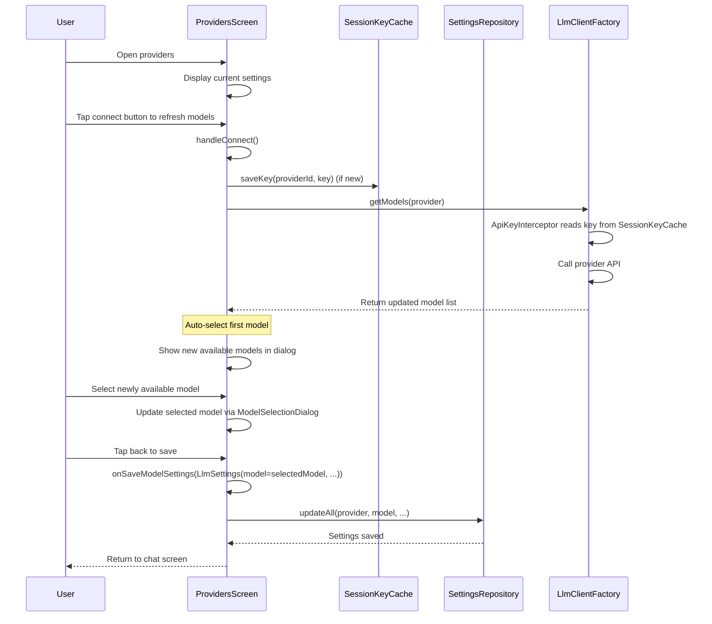
```mermaid
sequenceDiagram
    participant User
    participant ProvidersScreen
    participant SessionKeyCache
    participant SettingsRepository
    participant LlmClientFactory

    User->>ProvidersScreen: Open providers
    ProvidersScreen->>ProvidersScreen: Display current settings

    User->>ProvidersScreen: Tap connect button to refresh models
    ProvidersScreen->>ProvidersScreen: handleConnect()
    ProvidersScreen->>SessionKeyCache: saveKey(providerId, key) (if new)
    ProvidersScreen->>LlmClientFactory: getModels(provider)
    LlmClientFactory->>LlmClientFactory: ApiKeyInterceptor reads key from SessionKeyCache
    LlmClientFactory->>LlmClientFactory: Call provider API
    LlmClientFactory-->>ProvidersScreen: Return updated model list

    Note over ProvidersScreen: Auto-select first model

    ProvidersScreen->>ProvidersScreen: Show new available models in dialog

    User->>ProvidersScreen: Select newly available model
    ProvidersScreen->>ProvidersScreen: Update selected model via ModelSelectionDialog

    User->>ProvidersScreen: Tap back to save
    ProvidersScreen->>ProvidersScreen: onSaveModelSettings(LlmSettings(model=selectedModel, ...))
    ProvidersScreen->>SettingsRepository: updateAll(provider, model, ...)
    SettingsRepository-->>ProvidersScreen: Settings saved

    ProvidersScreen-->>User: Return to chat screen
```

### 12. History - Resume a Saved Session

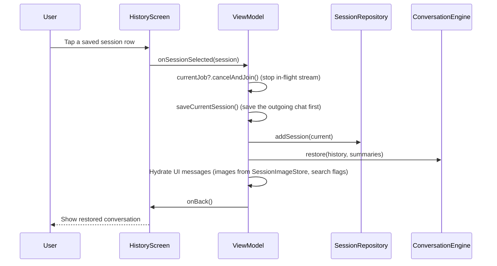
```mermaid
sequenceDiagram
    participant User
    participant HistoryScreen
    participant ViewModel
    participant SessionRepository
    participant Engine as ConversationEngine

    User->>HistoryScreen: Tap a saved session row
    HistoryScreen->>ViewModel: onSessionSelected(session)
    ViewModel->>ViewModel: currentJob?.cancelAndJoin() (stop in-flight stream)
    ViewModel->>ViewModel: saveCurrentSession() (save the outgoing chat first)
    ViewModel->>SessionRepository: addSession(current)
    ViewModel->>Engine: restore(history, summaries)
    ViewModel->>ViewModel: Hydrate UI messages (images from SessionImageStore, search flags)
    ViewModel->>HistoryScreen: onBack()
    HistoryScreen-->>User: Show restored conversation
```

- The most recent session is restored automatically at app startup; **New Chat** saves the outgoing chat before clearing.
- Bulk delete and the 30-day auto-delete purge follow the flows documented in [sessions.md](./sessions.md).

---

**Note**: These diagrams represent high-level happy path scenarios for providers, history, events, and about functionality. Detailed error handling and edge cases are not shown for clarity.
