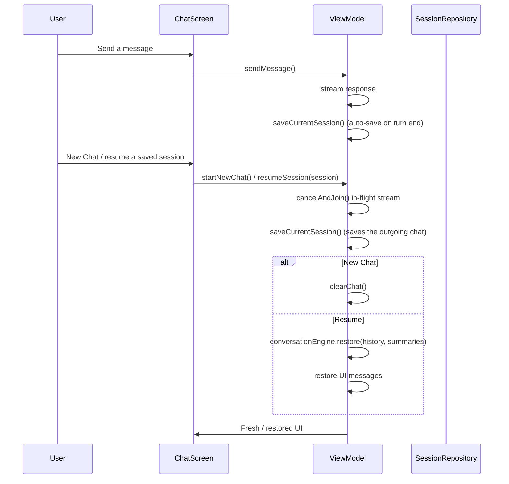
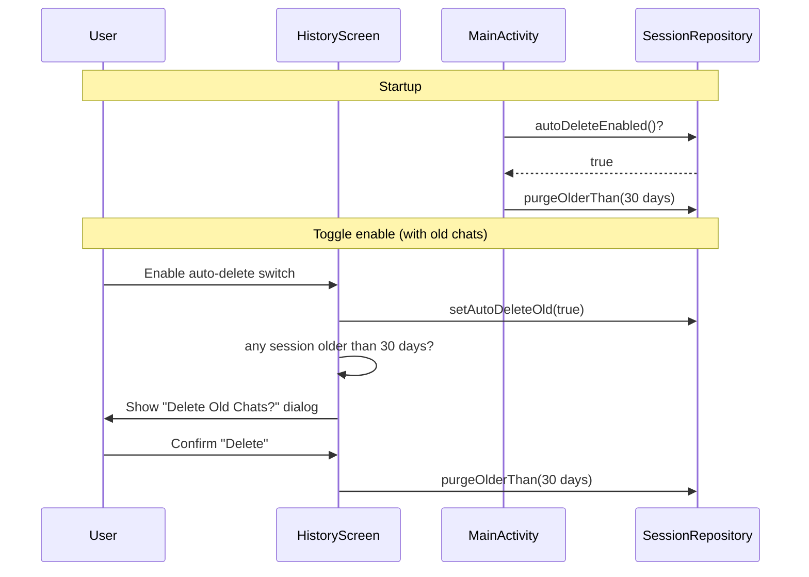

# Session Management & Chat History

Chat sessions are persisted locally so you can leave a conversation and resume it later. This document covers how sessions are saved, resumed, and automatically cleaned up.

## Overview

- **Single active chat**: the app shows one active conversation at a time, backed by a `SavedSession` persisted in a Jetpack DataStore (`"sessions"`).
- **Auto-save on every finished turn**: the current chat is saved automatically after each completed (or failed) response, so nothing is lost if the app is closed mid-conversation.
- **Auto-save on navigate**: the current chat is also saved to the History list when you start a new chat or resume a saved one (safety net).
- **No unsaved prompt**: a chat is only saved once it contains at least one user message; empty chats are discarded.
- **Title**: derived from the first user message, truncated to 50 characters (`Untitled` when blank).
- **Resume on launch**: the most recent session is reopened automatically when the app starts; tap **New Chat** to start fresh.

## Persistence Model

| Aspect | Detail |
|--------|--------|
| Storage | Backed by a `SessionStorage` strategy; Android uses Jetpack DataStore (`DataStore<Preferences>`, file `sessions`) |
| Format | A JSON array of `SavedSession` (Gson) in the `sessions_list` preference key (Android) |
| SavedSession | `id`, `title`, `createdAt`, `updatedAt`, `raw` (list of `SessionMessage`), `summaries`, `tags` |
| Cap | At most `SessionRepository.MAX_SESSIONS` (100) sessions are kept; the oldest are trimmed |
| Repository | `SessionRepository` + `SessionStorage` in `src/common/.../data/`; Android impl `DataStoreSessionStorage` in `src/android/.../data/` |
| Manager | `ChatSessionManager` in `src/common/.../chat/` (id/createdAt/dirty bookkeeping, save/reset/bind) |
| UI | `HistoryScreen` in `src/android/main/java/com/example/buddy/ui/history/` |

`createdAt` is set once when a session is first saved and never changes. `updatedAt` is refreshed on **every** save (including auto-saves after each turn), so a session you revisit always moves back to the top of the list and is re-aged for filtering and auto-deletion. Loaded sessions missing `updatedAt` (from before this field existed) are normalized to fall back to `createdAt`; likewise, messages missing `webSearchQueries` (from before that field existed) are normalized to an empty list. Gson deserializes via `Unsafe` and bypasses Kotlin default values, so these can surface as `null`.

## Tags

Each session is represented by 1–3 tags that summarize its topics, shown in the History screen both as filter chips and as small labels on each row.

- **Generation**: tags are produced **together with each summary** by the summarizer call (same JSON response, no extra LLM round-trip). See `docs/context-management.md`.
- **Aggregation**: at save time, `ChatSessionManager` derives the session tags mechanically from its summaries — `summaries.flatMap { it.tags }.distinct().takeLast(maxSessionTags)` — so the most recent exchanges win.
- **Survival under compression**: the merged "Earlier conversation" summary preserves the compressed group's tags mechanically (like key points), so old tags are not lost prematurely.
- **Cap**: at most `SummariesConfig.maxSessionTags` (default 3) tags are kept (`max_session_tags` in `res/values/conversation.xml`).
- **Lenient**: small models may omit `"tags"`, in which case the session simply has none; filter chips only show tags that actually exist.
- **Fixed set**: tags must come from a predefined 10-category list (`Politics`, `Business`, `World`, `Technology`, `Science`, `Health`, `Environment`, `Justice`, `Entertainment`, `Sports`) defined in the `session_tags` string-array in `res/values/conversation.xml`. The summarizer is told to choose only from these names; anything else is dropped and matched case-insensitively at load/normalize time.
- **Normalization**: legacy sessions missing or out-of-set `tags` (at either the session or the nested summary level) are normalized/filtered to the fixed set on load.

## Save & Resume Flow

- `sendMessage()` persists the session after each finished turn (both success and failure), so the active chat survives app closure.
- `startNewChat()` clears the text, engine history, summaries, and pending attachments; the outgoing chat is already saved.
- `resumeSession(session)` saves the current chat first, then restores the engine history and summaries for the chosen session and repopulates the UI.
- Both save the outgoing chat before changing state, so nothing is lost when navigating between conversations.

### Cancelling In-Flight Processing

When you start a new chat or resume a session while a response is still streaming, the ViewModel **cancels and joins** the running coroutine (`currentJob?.cancelAndJoin()`) **before** touching the state. This guarantees:

- The outgoing chat is built *after* the in-flight stream has fully stopped, so its captured state is complete and consistent.
- The old job's cleanup (which may set flags like `webSearchCancelled`) completes before the new chat starts, so a cancellation indicator from the old conversation never leaks into the new one.
- The old stream cannot append its assistant message or summaries into a just-restored session (the engine mutex is released on cancellation).

## History Screen

| Control | Behavior |
|---------|----------|
| Filter chips | All / Last 7 days / Last 30 days — filters the visible list by `updatedAt` |
| Tag chips | One chip per distinct tag across sessions; multi-select, AND semantics (selected tags must all be present). Combined with the time filter |
| Session rows | Tap to resume the conversation; shows title, date, and tag labels |
| Checkboxes + Delete selected | Bulk-deletes checked sessions |
| Auto-delete toggle | Enables/disables automatic deletion of chats not interacted with for 30 days |

## Automatic Deletion (30 days)

The **Auto-delete** toggle removes conversations whose `updatedAt` is older than 30 days. Two triggers exist:

1. **App startup** — if auto-delete is enabled, sessions older than 30 days are purged on launch.
2. **Enabling the toggle** — if any session older than 30 days exists, a confirmation dialog appears asking whether to delete them.

Behavioral notes:

- **No stale-age triggers while running**: auto-delete does **not** run periodically or on every History screen visit — only on the two triggers above.
- **Dialog only when there is something to delete**: if no session is older than 30 days, the toggle enables silently.
- **Flag persists either way**: declining the confirmation dialog leaves auto-delete enabled (the confirm is only about deleting the *old* chats immediately).
- The threshold lives in `SessionRepository.AUTO_DELETE_AGE_MILLIS` (30 days).
- Because `updatedAt` is refreshed on every save, an actively used chat is re-aged and will not be auto-deleted.

## SessionMessage Metadata

`SessionMessage` persists the web-search flags per assistant turn (`webSearchUsed`, `webSearchSkipped`, `webSearchQueries`) so the web-search indicators and query chips are preserved after resume. Image attachments are **not** stored inline in the DataStore JSON: `SessionImageStore` (Android) writes each image's JPEG bytes to `filesDir/session_images/<sessionId>/<index>.jpg` at save time and stores only the filename in `SessionMessage.imageRef` (`imageBase64` stays `null` on disk). On resume the files are read back into `imageBase64` so thumbnails and recent-pair re-sends work as before. Deleting a session or the 30-day auto-purge also deletes the session's image directory. Legacy sessions saved with inline Base64 keep working: `hydrate()` leaves messages without an `imageRef` untouched, and the next save migrates them to files. File attachments keep their name and extracted text (the raw `Uri` is not persisted).

## Related Files

- `src/common/main/kotlin/com/example/buddy/data/Sessions.kt` — `SavedSession` / `SessionMessage` data classes
- `src/common/main/kotlin/com/example/buddy/data/SessionRepository.kt` — session persistence logic, auto-delete flag, purge logic, cap
- `src/common/main/kotlin/com/example/buddy/data/SessionStorage.kt` — `SessionStorage` persistence interface
- `src/common/main/kotlin/com/example/buddy/chat/ChatSessionManager.kt` — id/createdAt/dirty bookkeeping, save/reset/bind
- `src/android/main/java/com/example/buddy/data/DataStoreSessionStorage.kt` — Android DataStore-backed `SessionStorage` implementation
- `src/android/main/java/com/example/buddy/data/SessionImageStore.kt` — file-backed storage for session image attachments (detach/hydrate/delete)
- `src/android/main/java/com/example/buddy/ui/history/HistoryScreen.kt` — History screen, filters, toggle + confirmation dialog
- `src/android/main/java/com/example/buddy/ui/chat/ChatViewModel.kt` — save/resume orchestration and streaming cancellation
- `src/android/main/java/com/example/buddy/MainActivity.kt` — startup purge trigger