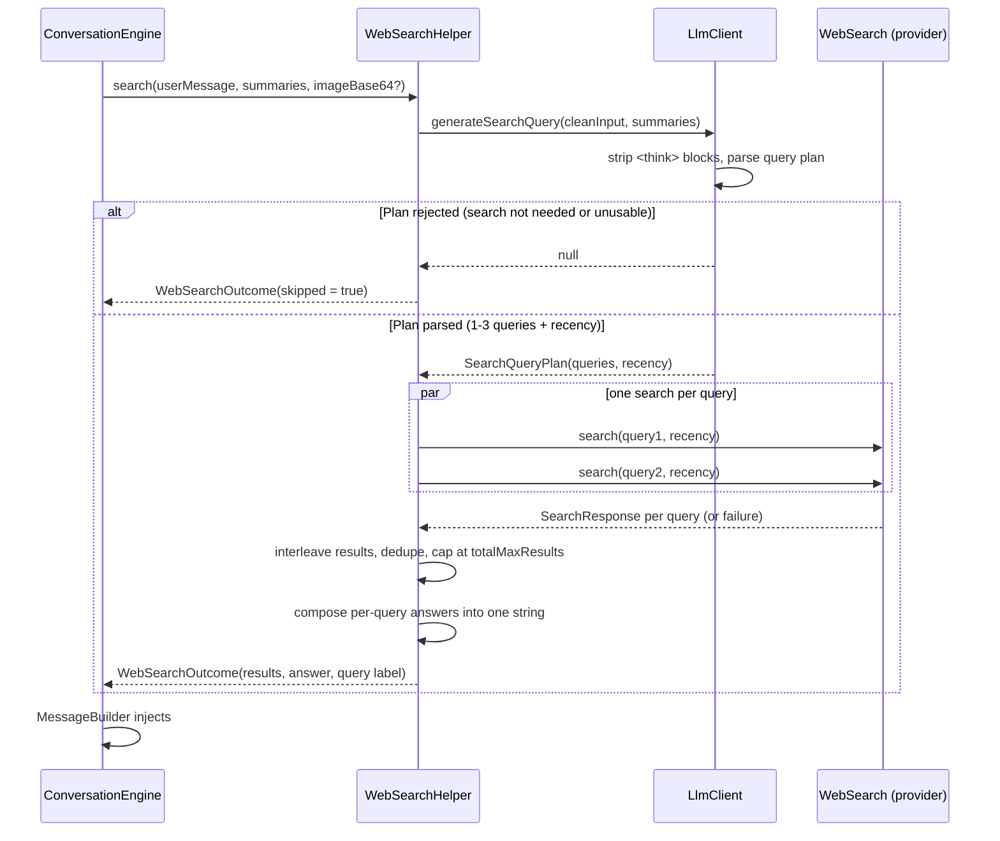

# Web Search Workflow

How Buddy decides whether to search, generates queries, fans them out across providers, and merges results back into the conversation.

## Pipeline Overview



Entry point: `WebSearchHelper.search()` (`src/common/main/kotlin/com/example/buddy/search/WebSearchHelper.kt`). Called from `ConversationEngine` before `MessageBuilder`, inside the same mutex-guarded turn described in [context-management.md](./context-management.md). Android and CLI consumers render the resulting engine events.

## Step 1 — Query Plan Generation

`LlmClient.generateSearchQuery()` (`src/common/main/kotlin/com/example/buddy/llm/LlmClient.kt`) asks the active model to convert the user's message into a plan:

```json
{"search": true, "queries": ["query 1", "query 2"], "recency": "day|week|month|any"}
```

`search` is a first-class boolean field: `false` (with an empty `queries` list) means the message doesn't need a search (greetings, casual conversation, questions about the assistant itself). Making "should we search?" an explicit field instead of a magic `NO_QUERY` token lets the parser treat any `false` value as a skip unconditionally. The prompt (`search_query_prompt` in `res/values/llm_prompts.xml`) opens by declaring the model a query planner that must never answer the user, and includes a wrong-output example. It asks for 1 query in the common case, and 2–3 only when the question has genuinely independent parts (comparisons, multiple unrelated topics). `recency` defaults to `any` when the model doesn't specify it.

The query-gen call is **non-streaming** (`executeNonStreamingRequest` in `OpenAIClient.kt`): the plan is tiny, nothing renders incrementally, and a non-streaming response exposes `finish_reason` (truncation) and the HTTP error body (a 400 is distinguishable from a network failure).

Conversation summaries are included in the prompt so pronouns/references in follow-ups ("what about there?") resolve correctly — see [context-management.md](./context-management.md).

### Image-Aware Query Generation

When the user attaches an image, `ConversationEngine` forwards `imageBase64` through `WebSearchHelper.search()` to `generateSearchQuery()` (`src/common/main/kotlin/com/example/buddy/llm/LlmClient.kt`). If the active model is multimodal (`isModelMultimodal(activeModel)`), the user message is sent as a content array with a `text` part plus an `image_url` data-URI part; otherwise the image is dropped and only the text is used. The `search_query_prompt` instructs the model to ground queries in what is visible in the image (object, species, landmark, error text) instead of vague words like "this".

Images are only sent to query generation when the underlying model supports it, so a text-only model never receives an `image_url` part in the query-gen call. For the main `/chat/completions` call, images are always attached to the user message regardless of model.

## Step 2 — Lenient Parsing (small-model tolerant)

Query generation may run on small (~9B parameter) models, whose output frequently deviates from the requested JSON shape. `parseQueryPlan()` (`src/common/main/kotlin/com/example/buddy/llm/LlmClient.kt`) never treats unparseable output as a searchable query: the worst outcome is a **skipped search**, never a garbage search. Only a null/blank raw response (network failure, HTTP error, or `finish_reason=length` truncation) still surfaces as a hard failure (`"Unable to generate search query"` error pill) or a skip with a reason code.

Parsing ladder, in order:

| Input shape | Handling |
|---|---|
| ` ```json {...} ``` ` code-fenced | Fences stripped, then parsed normally |
| `<think>...</think>` leakage | Stripped before parsing (hybrid-reasoning models) |
| `{"search": true, "queries": [...], "recency": "..."}` | Canonical shape |
| `{"search": false, "queries": [...]}` | Skip search unconditionally (`search` field wins) — reason code `search_field_false` |
| Bare JSON boolean (`false`) | Skip search |
| `{"queries": [...], "recency": "..."}` (legacy, no `search` field) | Accepted |
| `{"query": "..."}` (singular key) | Accepted as a 1-query plan |
| `{"queries": "a single string"}` | Accepted as a 1-query plan |
| Bare JSON array `["q1", "q2"]` | Accepted |
| Bare JSON string `"q1"` | Accepted |
| JSON wrapped in prose ("Here is the query: {...}") | First `{...}` block regex-extracted, then parsed |
| **No JSON found anywhere** | **Skip search** — the response is treated as the model answering directly, never as a query. An `EventLog.warning` is recorded so the deviation is visible in the Events screen |
| **Answer-shaped query strings** (per extracted query, after parsing) | A query that exceeds `search_query_reject_chars` (256), contains a newline/code fence, starts a line with `- `/`* `/`#`, or contains ≥2 sentence boundaries followed by an uppercase is dropped as prose. If all queries drop, the search is skipped — reason code `rejected_answer_shaped` |
| `finish_reason=length` | Skip search — a truncated plan must not be brace-repaired into plausible-looking half-queries — reason code `truncated` |
| `>3` queries, duplicates, blank entries | Clamped to 3, deduped case-insensitively (again after truncation), blanks dropped |
| Overlong query (≤ reject threshold) | Word-boundary-truncated to `search_query_max_chars` |
| Bad/missing `recency` value | Maps to `ANY` — never fails |
| Everything drops out (empty after validation) | Treated as skip |

Query validation deliberately stays narrow (length + line structure + multi-sentence) so realistic queries with dots, operators, hashes, or CJK text ("Node.js 22 LTS", `site:github.com -android`, "C# generics", "St. Louis weather") are never rejected.

## Step 3 — Parallel Fan-Out

`WebSearchHelper.search()` runs one `webSearch.search(query, recency)` call per query concurrently (`async`/`awaitAll` inside `coroutineScope`). Each call is wrapped so a `CancellationException` still propagates immediately (cooperative cancellation isn't broken by the fan-out), while any other exception is captured as a per-query failure instead of aborting the whole search.

- **Partial failure tolerated**: if 1 of 3 queries fails, the search still completes using the other 2 results, with a warning logged. Only when **all** queries fail does the error surface as the existing "Web search failed" error pill.

## Step 4 — Merge

1. **Interleave**: per-query result lists are merged round-robin (query1[0], query2[0], query1[1], query2[1], ...) so every subtopic stays represented near the top of the merged list instead of one query's results exhausting the list before the next query's results appear.
2. **Dedupe + clean**: the existing `cleanResults()` drops blank results and dedupes by `domain + title`, trims each result's content to `search_result_content_max_chars` (2000).
3. **Cap**: the merged list is capped at `search_total_max_results` (10) — bounds the worst case (3 queries × 6 results = 18) down to a manageable prompt size.
4. **Answer composition**: each provider that returns a native synthesized answer (see capability table below) contributes one. A single query's answer passes through unchanged; multiple queries' answers are joined as `**query text:** answer` paragraphs so the `### Search Engine Summary` section and the UI pill need no format-specific handling.
5. **Query display**: the UI shows one pill per query (first reads "Searched: `<query>`", the rest show the bare query text) so multi-query searches don't get truncated behind a single ellipsized pill. EventLog still logs the full list joined with " · " for quick scanning.

## Recency → Provider Parameter Mapping

`SearchRecency` (`ext/search/WebSearch.kt`) is `DAY | WEEK | MONTH | ANY`. For `ANY`, no recency parameter is sent at all — a single-query, no-recency search produces a byte-identical request to the pre-multi-query implementation.

| Provider | Parameter | Format | Notes |
|---|---|---|---|
| Tavily | `time_range` | `"day" \| "week" \| "month"` | Omitted for `any`. Confirmed live: changes the returned result set even though `published_date` isn't populated (see capability table). |
| LinkUp | `fromDate` | ISO date `YYYY-MM-DD`, `today − {1,7,31} days` | Omitted for `any`. |
| Exa | `startPublishedDate` | ISO date `YYYY-MM-DD` | Omitted for `any`. Live-verified: Exa accepts the date-only format (no need for a full timestamp) and correctly filters results to that window. May exclude undated pages. |

Date math: `SearchRecency.sinceDateOrNull()` in `ext/search/WebSearch.kt`, using `java.time.LocalDate`.

## Provider Capability Table

| Provider | Native answer | Publish dates | Recency filter |
|---|---|---|---|
| Tavily | ✅ `include_answer: advanced` → `answer` field | ❌ `published_date` is always `null` at the default `topic: "general"` (only populated when `topic: "news"` is set, which the app doesn't send) | ✅ confirmed — filters server-side even without visible dates |
| LinkUp | ✅ `outputType: sourcedAnswer` → `answer` field | — (not extracted) | ✅ (via `fromDate`) |
| Exa | ❌ no answer field; always `null` | ✅ `publishedDate` populated | ✅ confirmed live — date-only `startPublishedDate` accepted |

## Error Handling Summary

| Scenario | Outcome |
|---|---|
| Model returns `search: false`, prose with no JSON, only answer-shaped queries, or `finish_reason=length` | `WebSearchOutcome(skipped = true)` — no search pill, no Web Data section. A reason code (`search_field_false`, `no_json`, `rejected_answer_shaped`, `truncated`, `empty_plan`) is logged per path |
| Query-gen call fails at the HTTP layer (network error, non-2xx) | Throws `"Unable to generate search query"` → error pill; the non-streaming call logs `HTTP <code>: <body>` so a rejected request is diagnosable |
| Some (not all) queries fail | Search completes with the successful subset; warning logged |
| All queries fail | Last failure's exception surfaces as the error pill; response still streams without Web Data |
| Search returns zero results after merge/dedupe | `WebSearchOutcome(errorMessage = "Web search returned no results")` |

## Resource Configuration

| Resource | File | Default | Purpose |
|---|---|---|---|
| `search_query_prompt` | `res/values/llm_prompts.xml` | — | Query-plan generation prompt (`search` boolean + JSON shape + few-shot and wrong-output examples) |
| `web_data_instructions` | `res/values/llm_prompts.xml` | — | Guidance injected above `## Web Data`: prefer fresh results for time-sensitive claims, cite URLs, flag conflicts, treat Search Engine Summary as a starting point not ground truth |
| `search_query_temperature` | `res/values/llm_defaults.xml` | `0.2` | Temperature for the query-gen call |
| `search_query_max_chars` | `res/values/llm_defaults.xml` | `128` | Per-query truncation limit (word-boundary) |
| `search_query_max_tokens` | `res/values/llm_defaults.xml` | `512` | Output budget for the query-gen call (was 4096 — bounded so a model cannot ramble into an essay) |
| `search_query_reject_chars` | `res/values/llm_defaults.xml` | `256` | Length above which an extracted query is rejected as answer-shaped rather than truncated |
| `search_max_results` | `res/values/llm_defaults.xml` | `6` | Results requested per individual provider call |
| `search_total_max_results` | `res/values/llm_defaults.xml` | `10` | Cap on the merged/deduped result list across all queries |
| `search_result_content_max_chars` | `res/values/llm_defaults.xml` | `2000` | Per-result content truncation before injection |

All accessed via `AppConfigProvider.current.search.*` (`config/AppConfig.kt`), backed by `res/values` XML on Android and the bundled `values/` resources on desktop.

## Related

- [context-management.md](./context-management.md) — how search results are injected as a `## Web Data` system message alongside summaries
- [seq_chat.md](./seq_chat.md) — end-to-end chat sequence diagrams including web search scenarios
- [limitations.md](./limitations.md) — known constraints (query quality on small models, API cost of multi-query fan-out, provider date-field gaps)
